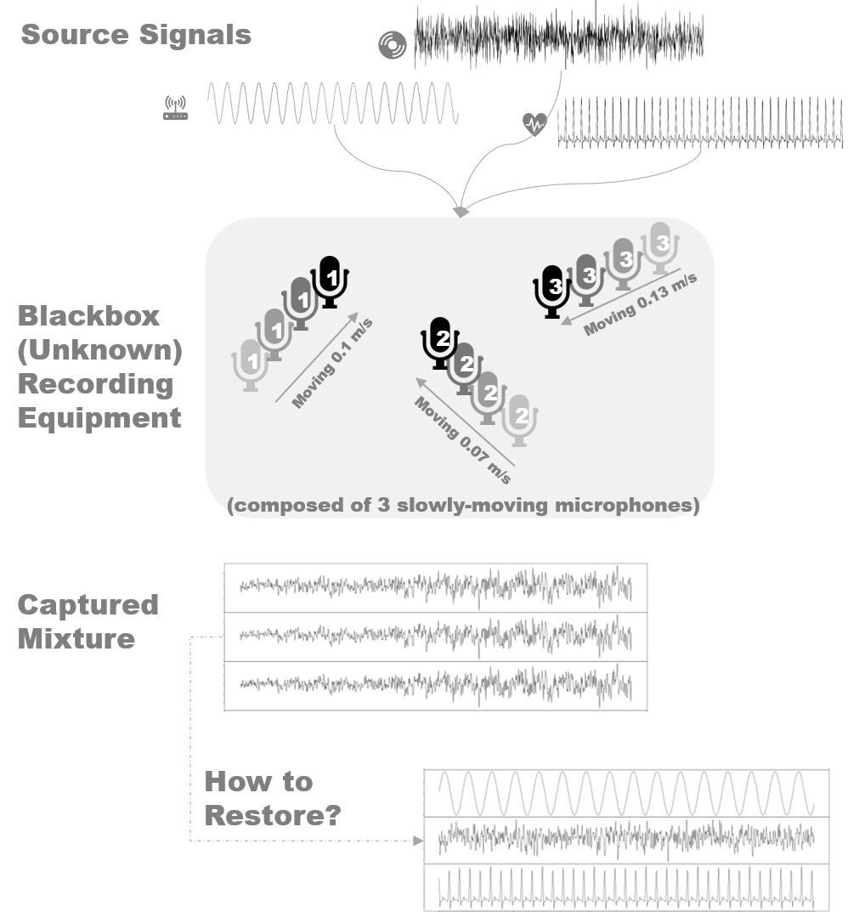

# Introduction {#intro}

Imagine a situation that a small musical band composed of a piano, a bass, and a drum is playing at the stage, while 3 microphones are recording its performance. Rather than each microphone records one specific instrument, it can be expected that each captures a slightly different mixture of the original sounds from the trio. In a real-world situation, there exist diversified needs for extracting structured information from observable mixtures of unknown signals. For example, a recording of speech may contain external noise from nearby road traffic, minor discussion among the audience and constant electronic interference in addition to the speech voice itself. 

In most cases, the mixing mechanism is unclear or too costly to measure, and thus it arises a set of statistical problem to seek restoration of source signals given observed ones based on a certain proper statistical assumption - independence as an example. Further, the mixing mechanism is not necessarily static; in recording, the microphones can be moving slowly towards or against the artists due to some relative movement (dancing, walking, etc.). Figure \@ref(fig:algorithm) provides a simple illustration of the BSS problem.

```{r illustration, fig.cap='Illustration of Blind Source Separation with Time-varying Factor', out.width='90%', echo = FALSE}

```

Blind Source Separation (BSS) is a set of unsupervised machine learning algorithms in terms of input being only a single data matrix. The characteristics of output usually cannot be accurately foreseen in advance due to lack of other relevant evidence and such algorithms mostly serve as exploratory purposes [@hyvarinen2013independent]. Compared with supervised learning like regression and classification tree, unsupervised ones are more challenging and has a tendency to be more subjective in the absence of a clear goal. Nevertheless, BSS and other exploratory data analysis gain increasing importance especially in online marketing and healthcare industry [@james2013introduction]. The modern information technology grants the massive quantity of data, but subtracting structural insights could be an enormous challenge. The "blind" approaches endeavor to provide a unique perspective of data if computation resources are sufficiently available with rather limited human interferences.

This thesis expands the static source separation problem into linearly time-varying one that developed from previous researches, employing relatively modern tools. A functional full implementation and associated utilities in `R` will be produced. Proceeding sections will first formulate the BSS problems and review established solutions, and then elaborate the linearly time-varying structure of second-order source separation. Chapter \@ref(tvsobi) presents the new algorithm in detail, followed by performance measurement. Finally, the thesis shall be concluded with a discussion of potential extension and performance-related topics.

Vectors and matrices are always marked as bold symbols while a lower case letter stands for a real-valued number. The most commonly used symbols are summarized below.

Table 1: Notation

| Symbol | Meaning | Note |
|---|---|---|
| $\boldsymbol I$ | identity matrix| compatible dimensions are assigned|
| $\boldsymbol z$ | source signals| $p\times T$ matrix or $p$-vector; a realization of (unobservable) stochastic process $(Z_t)$ |
| $\boldsymbol x$ | observed signals| $p\times T$ matrix or $p$-vector; a realization of (unobservable) stochastic process $(X_t)$ |
| $\boldsymbol\mu$ | row means of a matrix   |  vector  |
| $\boldsymbol\Omega_t$ | mixing matrix at given time point $t$ | $p\times p$ matrix. $\boldsymbol\Omega_t = ( \boldsymbol I+t \boldsymbol{\mathcal E}) \boldsymbol\Omega$ |
| $\boldsymbol\Omega$ | mixing matrix at $t=0$ | $\boldsymbol\Omega \overset{\text{def}}= \boldsymbol\Omega_0$ |
| $\boldsymbol{\mathcal E}$ |time-varying mixing factor | $p\times p$ matrix |
| $\boldsymbol\Lambda_{\tau}$ | autocovariance given stationarity | $p\times p$ matrix that depends only on lag $\tau$ and assumed to be diagonal |
| $\boldsymbol R_{\tau} = \boldsymbol{\Omega \Lambda}_{\tau} \boldsymbol\Omega'$ | partially mixed autocovariance  | $p\times p$, a short-hand notation|
| $\boldsymbol K ^{(p,p)}$ | commutation matrix | $p^2\times p^2$ |
| $t=1,2,\dots,T$ | index of time | use in subscript. $t=0$ is a pseudo notation and $t=1,\ t=T$ are the first and last observation in the time series correspondingly | 
| $\tau \in \{0\}\bigcup L$ | pre-selected time lag | An integer. 0 is included for covenience |
| $L = \{\tau_1,\tau_2,\dots,\tau_l\}$ | set of pre-selected lags | $l$-item set of positive integers |
| Operator $\boldsymbol{A}'$ |  matrix transpose of $\boldsymbol A$| |
| Subscript $\boldsymbol{A}_t$  | the $t$-th column vector of $\boldsymbol{A}$ | observation at time $t$ |
| Function $\text{vec}( \boldsymbol A)$ | vectorization (by-column) of $\boldsymbol A$ | |
| Operator $\otimes$ | Kronecker product | |
| Index $\boldsymbol{A}[i,j]$ | value at the $i$-th row $j$-th column of matrix $\boldsymbol{A}$ | |
