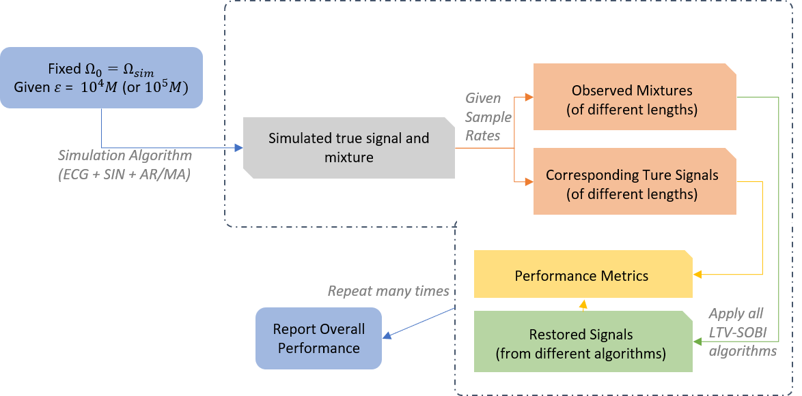
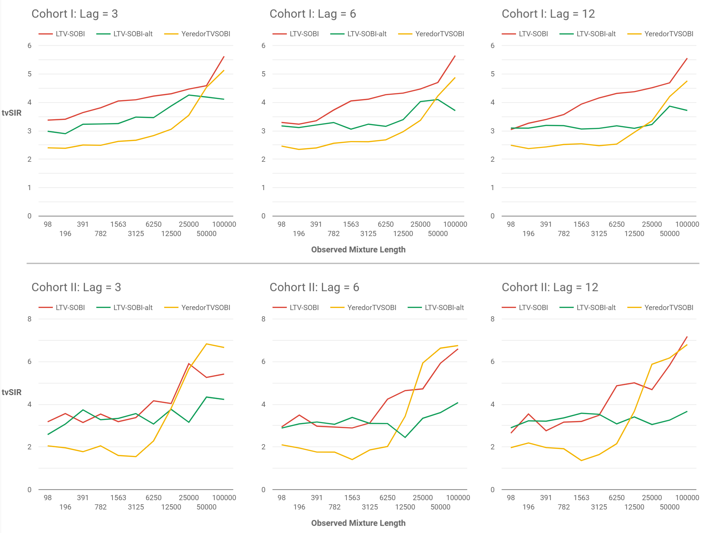
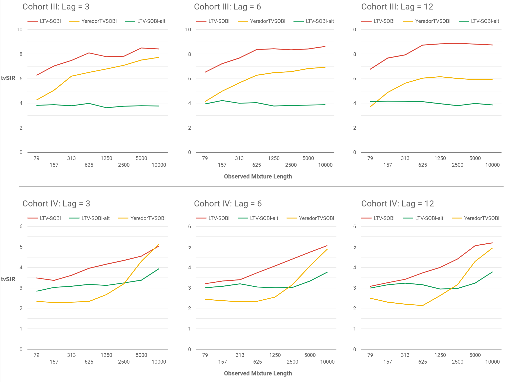
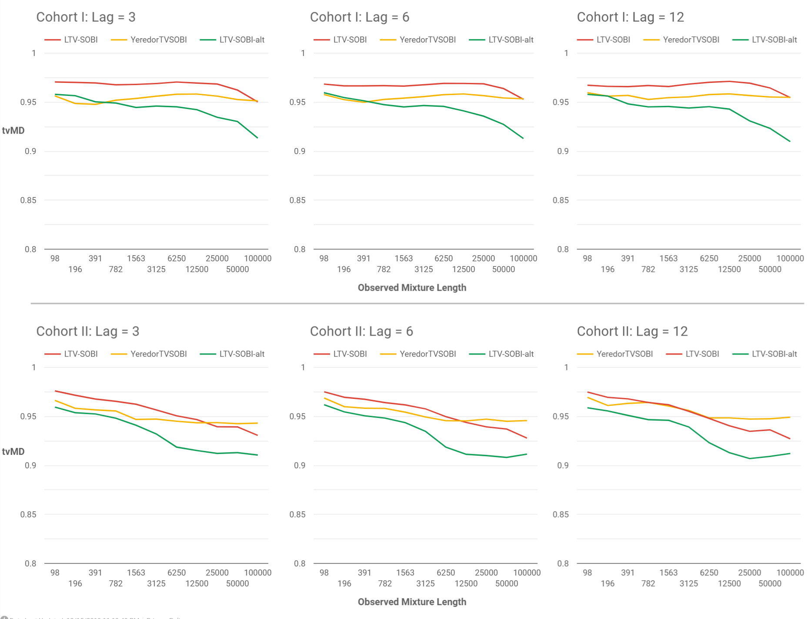
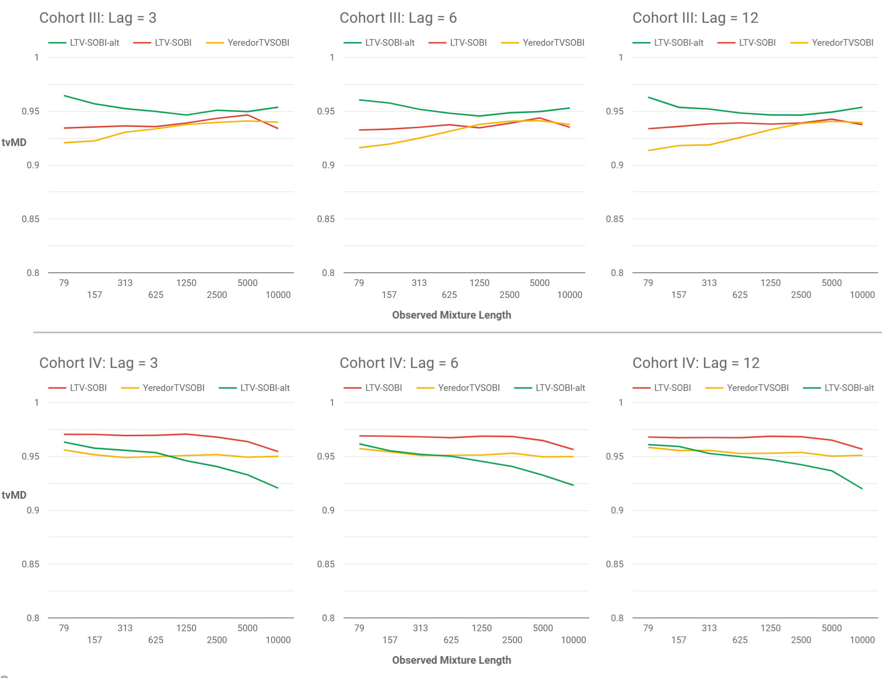

# LTV-SOBI Performance Measures and Simulation Studies {#performance}

The accuracy and effectiveness of the LTV-SOBI algorithm principally depends on the source signals and observed mixture themselves, especially on the assumptions of uncorrelatedness and stationarity. Nevertheless, when compared with SOBI, LTV-SOBI is expected to be embedded with extra accuracy losses due to its relatively more complex mixing mechanism and associating algorithms. In spite of mathematically negligible residuals/errors in each step of the algorithm, the inherent losses can accumulate in sample autocovariance decomposition, approximate joint diagonalization and deriving $\boldsymbol{\mathcal E}$ and $\boldsymbol \Omega_0$. Precision can be further compromised when `nearPD` has to enforce in case of non-positive semi-definite matrices. In contemplation of addressing time-varying characteristics, modification to existing BSS performance indices are needed.

## Extension of Minimal Distance Index

The minimal distance index, denoted as MD, was initially introduced by Ilmonen [-@ilmonen2010new] to measure the ICA algorithm performance by comparing true mixing matrix $\boldsymbol \Omega$ and estimated unmixing matrix $\widehat{\boldsymbol \Gamma}$. For a non-time-varying model, MD-index is defined as, 

\begin{equation}
\text{MD} (\widehat{ \boldsymbol {\Gamma}}) = \frac 1 {\sqrt{p-1}} \inf\limits_{ \boldsymbol C \in \mathcal C} || \boldsymbol C \widehat{ \boldsymbol {\Gamma}} \boldsymbol \Omega - \boldsymbol I_p||
(\#eq:md)
\end{equation}

where $\mathcal C$ is the set of matrices that permits permutation and scale ambiguity, i.e. each row and column contain exactly one non-zero element. Even though MD-index is a well-designed measure for the majority of the BSS algorithms in addition to ICA, the time-varying case require adaptation.

The true mixing matrix $\boldsymbol \Omega_t$ is varying over time $t=1,2,\dots,T$ in TV-SOS model, and same holds for $\widehat{ \boldsymbol \Gamma_1}$. Therefore, this thesis proposes a time-varying version of the MD-index as defined in equation \@ref(eq:tvmd).

\begin{equation}
\text{tvMD}(\{\widehat{ \boldsymbol \Gamma_1}, \widehat{ \boldsymbol \Gamma_2}, \dots, \widehat{ \boldsymbol \Gamma_T}\}) = \frac 1 T \sum\limits_{t=1}^T \text{MD}(\widehat{ \boldsymbol \Gamma_t})
(\#eq:tvmd)
\end{equation}

Since TV-SOS model \@ref(eq:tvsobi) determines all $\widehat{\boldsymbol \Gamma_t} = \widehat{\boldsymbol \Omega_t}^{-1}$ by the pseudo initial mixing matrix $\boldsymbol \Omega_0$ and the time varying factor $\boldsymbol{\mathcal E}$, the tvMD can be determined once LTV-SOBI algorithm is completed and the true mixing is known.

As tvMD is officially a mean value of MD-indies over a time span, it has a value between $0$ and $1$ that is identical to original MD by central limit theorem, and the smaller value the better separation.

## Extension of Signal-to-Inference Ratio

In information processing, researchers tend to decompose the restored signals into 4 parts: (1) target signals; (2) interference from other sources; (3) noise and (4) artifacts that are originated from separation and evaluation algorithm. The decomposition can be written as [adapted @na2013performance; @vincent2006performance],

\begin{equation}
\boldsymbol z = \boldsymbol s_\text{signal} + \boldsymbol s_\text{interf} + \boldsymbol e_\text{noise} + \boldsymbol e_\text{artif}
(\#eq:foursignal)
\end{equation}

The target signal $\boldsymbol s_\text{signal}$ is not necessarily the exact source signal. Instead, carefully-selected and evaluated transformation of a source is permissible in response to the identifiability issue in BSS, and it is common to tolerate certain transformation. In particular, permutation and scaling do not usually affect signal interpretation. Some literature denotes interference as $\boldsymbol e_\text{interf}$ when falsely mixing of sources is regarded as an error even though it is originated from sources. For example, the restored signal series II mainly corresponds to source series IV, but also have a partial mixture from source series I. In this case, the former is undoubtful $\boldsymbol s_\text{signal}$, and the later should be treated as erroneous interference. Preceding BSS researches, especially under information processing domain, use Signal-to-Inference Ratio (SIR) to measure the similarity between true and restored signals [@eriksson2000source; @vincent2006performance], and its definition is,

\begin{equation}
\text{SIR}= 10 \log_{10} \frac{|| \boldsymbol s_\text{target} ||^2}{|| \boldsymbol s_\text{interf}||^2}
(\#eq:sir)
\end{equation}

The LTV-SOBI algorithm by nature does not involve any external noise, and even if the noise is present in source signals, it shall become a part of true signals. Further, $\boldsymbol e_\text{artif}$ is assumed to be $\boldsymbol 0$ for simplicity. Assume the restored signal to be $\widehat{\boldsymbol z}$ and the permutation/scaling matrix $\boldsymbol C$ as defined in \@ref(eq:md); the signal decompose of \@ref(eq:foursignal) become,

\begin{equation}
\begin{aligned}
\widehat{\boldsymbol z} &= \boldsymbol {s}_\text{signal} + \boldsymbol s_\text{interf}
\\ &= \boldsymbol {Cz} + (\widehat{ \boldsymbol x} - \boldsymbol {Cz}) 
\end{aligned}
(\#eq:twosignal)
\end{equation}

Without doubt, time-varying factor should be considered, and the extension can be achieved by introducing a time index, that is, $\widehat{\boldsymbol z}_t = \boldsymbol C_t \boldsymbol z_t + (\widehat{ \boldsymbol z}_t - \boldsymbol C_t \boldsymbol z_t)$. The SIR-index should also be slightly modified to include convolution over $t=1,2,\dots,T$.

The SIR-index for TV-SOBI can be simplified by taking $\boldsymbol C_t = \text{diag}( \boldsymbol \Omega_t \widehat{ \boldsymbol \Omega}_t^{-1})$ after a permutation fix. In practice, the permutation is found by arranging the numerically largest values to diagonal position either row-by-row or column-or-column in $\boldsymbol \Omega_t \widehat{ \boldsymbol \Omega}_t^{-1}$. Finally, the time-varying SIR-index is the measure of all diagonal values against off-diagonal items, and it is formulated as,

\begin{equation}
\text{tvSIR}= 10 \log_{10} \frac{ \sum\limits_{t=1}^T|| \text{diag}( \boldsymbol \Omega_t \widehat{ \boldsymbol \Omega}_t^{-1}) ||^2}{ \sum\limits_{t=1}^T || \text{off}( \boldsymbol \Omega_t \widehat{ \boldsymbol \Omega}_t^{-1})||^2}  ,
(\#eq:tvsir)
\end{equation}

where, $\boldsymbol \Omega_t \widehat{ \boldsymbol \Omega}_t^{-1} = ( \boldsymbol I + t \boldsymbol{\mathcal E})\boldsymbol \Omega_0 \big[ ( \boldsymbol I + t \widehat{\boldsymbol{\mathcal E}}) \widehat{\boldsymbol \Omega}_0\big]^{-1}$.

SIR and tvSIR do not have a direct mathematical connection to each other, but the values are comparable, since they both the similarity between true source and the restored one. SIR and tvSIR range from $-\infty$ to $\infty$, and the larger the better. It should also be noted that correlation-based SIR (e.g. the implementation in `JADE` package [@miettinen2017blind]) does not require true mixing parameters to be known, but tvSIR will always require so. This is a result of different mixing mechanism and $tvSIR$ definition. With regards to the correlation-based SIR(s) in LTV-SOBI, it does not seem optimal for the assumption of small-valued $\boldsymbol{\mathcal E}$ that could lead to unrobust measurement when inversing.

## Simulation Study

The performance of LTV-SOBI is expected to be significantly influenced by signal inherited properties, dimension, length and the scale of mixing matrix. Despite the impossibility to inscribe exact factors that impair the performance, simulations have been devided into 4 cohorts and conducted in _R_. Intending to minimize potential bias, the four cohorts have similar sources of 3-dimensional signal that involve sinusoidal and electrocardiograph (ECG) time-series, together with a moving-average or auto-regressive series. The simulated signals are analogous to those in Figure \@ref(fig:ambiguity) with the dissimilarity in that the simulation study has 1 less dimension of either moving-average or auto-regressive series. The reduction of dimension is due to computational efficiency and visual similarity of such two signals. For convenience, define two matrix constants to be,

\begin{equation}
\boldsymbol \Omega_{\text{sim}} = \begin{bmatrix} 2 & -6 & 0.5 \\  -9 & 5  & 3 \\ -4 &6 &8 \end{bmatrix}
\text{ and }
\boldsymbol M = \begin{bmatrix} -3 & 6 & -6 \\ -4 &2.5 & 6\\ 9&2.1 &7 \end{bmatrix}
(\#eq:simmat)
\end{equation}

In simulation configuration, the initial mixing matrix $\boldsymbol{\Omega}_0$ is first arbitrarily fixed to $\boldsymbol \Omega_{\text{sim}}$ as in \@ref(eq:simmat). Then, 4 cohorts of simulation are parameterized with differed time-varying factors and signal length, while the difference is only in terms of the scale with details given  in Table \@ref(tab:foursets). In each cohort, the true source signal and mixture are thus fixed. 


Table: (\#tab:foursets) Key Configuration Parameters of Simulation Cohorts

|  | I | II | III | IV |
|---|---|---|---|---|
| $\boldsymbol{\mathcal E}$ | $\boldsymbol M \times 10^{-5}$ | $\boldsymbol M \times 10^{-4}$ | $\boldsymbol M \times 10^{-5}$ | $\boldsymbol M \times 10^{-4}$ |
| Simulated Total Length | $100000\ (10^5)$ | $100000\ (10^5)$ | $10000\ (10^4)$ | $10000\ (10^4)$ |
| Sampling Frequency | 1:1 - 1024:1 | 1:1 - 1024:1 | 1:1 - 512:1 | 1:1 - 512:1 |
| Observed Length | 100000 - 98 | 100000 - 98| 10000 - 40 | 10000 - 40 |

In the realistic scenario, true source is unobservable while mixture can be observed only at certain sampling rates (aka. sampling frequencies). For example, a piece of sound shall include 4800k samples per second as signal mixture, but the recording equipment can only sample at 48kHz, which means that merely 1 out of every 100 mixture is sampled as observation. Aiming to simulate in accordance to such scenario and to evaluate how the observation length could affect LTV-SOBI performance, the simulation study further generates artificial observed mixture and corresponding source upon different sampling rates based on the same source and mixture. Figure \@ref(fig:samplingRate) illustrates the sampling mechanism, and Table \@ref(tab:foursets) summarized the sampling rates in each cohort. Consequently, multiple mixtures of different lengths (as a result of sampling rates) are simulated within each cohort. In brief, instead of generating new pseudo sources and mixtures, the simulation study considers the sampling frequencies as a more robust alternative.

```{r samplingRate, fig.cap='Illustration of 10:1 sampling rate - only signals at blue vertical bars are sampled and observed', out.width='85%'}
plot.ts(fig_mixing$mix[,1:3], main="", ann = FALSE,
        panel = function(x, col = col, bg = bg, pch = pch, type = type, ...){
          lines(x, col = col, bg = bg, pch = pch, type = type, ...)
          for(a in seq(1, 1000, by=10)) segments(a, -99, a, x[a], col = "blue")
        })

```

In the next step, LTV-SOBI algorithms along with various alternatives are applied to each generated observed mixture, and the results are compared against its corresponding true signal using tvMD and tvSIR, which finally leads to performance metrics. Each observed mixture has 7 different algorithms applied, including 2 types of Yeredor's TV-SOBI (with and without quadratic form), 4 types of LTV-SOBI (with and without symmetry fix, with and without quadratic form) and LTV-SOBI-alt.

Finally, over 1000 similar simulations are performed to further eliminate potential bias and outliers, and enable reporting of bootstrap results. Figure \@ref(fig:simOverview) overviews the simulation study in the manner of progress flow, and the full _R_ code is attached in Appendix \@ref(simcode).

```{r simOverview, fig.cap='Overview of Simulation Study Settings', out.width='99%'}

```

## Simulation Study Results

Aforementioned tvSIR and tvMD, served as a time-varying application of SIR and MD correspondingly, are applied to measure the algorithm performance in terms of accuracy and capability of restoring the original signals, and results are reported in Figures \@ref(fig:resultA)-\@ref(fig:resultD). Each sub-graph reports a specific simulation cohort with a defined lag parameter used in the LTV-SOBI algorithm. The curves visualize the performance influenced by sampling frequencies, which are equivalent to observed signal lengths. Different algorithms can be distinguished by line color.

Simulations showed that minor alternatives do not significantly affect the performance of a given algorithm. For example, whether symmetry correction for estimated matrices in LTV-SOBI does not affect the overall performance metric. Therefore, further results presented below are aggregated, for convenience and simplicity, only over the major algorithms, namely LTV-SOBI, LTV-SOBI-alt, and Y-TVSOBI. Consequently, a point in Figure \@ref(fig:resultA) and \@ref(fig:resultD) represent the mean value of correponding simulations. In addition, there is a separated web-based interactive dashboard, which is available at http://bss.yan.fi, to enable investigation of performance metrics from various perspectives, including those that are not directly reported in the sections.

Figures \@ref(fig:resultA) and \@ref(fig:resultB) presumes to exhibit better performance measured by tvSIR with a larger value; the higher the points and curves the better. The missing values and other deviations will be deliberated in Chapter \@ref(discussion). As seen in the results, the new LTV-SOBI outperformed Yereodr's original TV-SOBI in most cases, while the comparable advantage seems to be diminished with increased observed length. On the other hand, the LTV-SOBI-alt algorithm is relatively insensitive to length, though it could not benefit from the larger size of observed information.

```{r figConfig, include = FALSE, eval = FALSE}

######### replace by screenshot #########
res_sum <- res %>%  filter(note != "") %>% 
  group_by(criteria, seriesT, method, N, p, lagT)  %>% summarise_at("value", mean)
res_cnt <- res %>%  filter(note != "", note != "new206") %>% 
  group_by(criteria, seriesT, method, N, p, lagT)  %>% tally

getPlot <- function(criteria, cutoff, setVector, yaxisname, limitsVector){
  m <- unique(res_sum$criteria)[criteria]

  res_sum %>%

    filter(criteria == m, N > cutoff, method != "frjd", lagT != "Lag = 1", seriesT %in% setVector) %>%
    ggplot(aes(N, value, color = method, shape = method, linetype = method)) +
    #geom_point(size = 1) + 
    geom_line() + 
    scale_color_brewer(palette = "Set2") +
    scale_x_log10() +
    facet_grid(seriesT~lagT) +
    scale_y_continuous(name=yaxisname, limits=limitsVector) +
    theme(legend.position="bottom",
          panel.background = element_rect(fill = "white", colour = "grey"),
          axis.text.x = element_text(angle = 90))
  
}
```

```{r resultA, fig.cap='Performance measured by tvSIR for Cohort I and II when the sources separted using LTV-SOBI, LTV-SOBI-alt and Yeredor TVSOBI (the larger the better)', out.width='98%'}
# print(getPlot(4, 90, c("Set I", "Set II"), "tvSIR", c(0,12)))

```

```{r resultB, fig.cap='Performance measured by tvSIR for Cohort III and IV when the sources separted using LTV-SOBI, LTV-SOBI-alt and Yeredor TVSOBI (the larger the better)', out.width='98%'}
#  print(getPlot(4, 30, c("Set III", "Set IV"), "tvSIR", c(0,12)))

```

Using tvMD, Figures \@ref(fig:resultC) and \@ref(fig:resultD) demonstrate better performance with lower value, and LTV-SOBI-alt is comparably the best algorithm in most cases except for simulation cohort III; larger observation regularly leads to improved performance. The difference among the three major algorithms are essentially minor.

```{r resultC, fig.cap='Performance measured by tvMD for Cohort I and II (the smaller the better)', out.width='98%'}
# print(getPlot(2, 90, c("Set I", "Set II"), "tvMD", c(0.8, 1)))

```

```{r resultD, fig.cap='Performance measured by tvMD for Cohort III and IV (the smaller the better)', out.width='98%'}
# print(getPlot(2, 30, c("Set III", "Set IV"), "tvMD", c(0.8, 1)))

```

In conclusion, the extension of MD and SIR grants insights into algorithm performance; the simulation results suggest that time-varying blind source separation problems are yet rather challenging as the tvSIR and tvMD values are not sufficiently good. LTV-SOBI algorithm is a comparably more applicable and effective approach. Nonetheless, the metric is not robust enough under all scenarios, and Section \@ref(discussion) will attempt to detail underlying issues. Finally, the simulation results have to exclude the comparison with ordinary SOBI because of non-compatible metrics; SOBI would be penalized by the time-varying model while benefiting from its ignorance of possible extreme values caused by $\boldsymbol{\mathcal E}$. Supposing the metric is acceptable with SOBI, the results prefer SOBI under large size of observations and LTV-SOBI when the observed length is relatively small. The interative dashboard provides the detailed SOBI results.