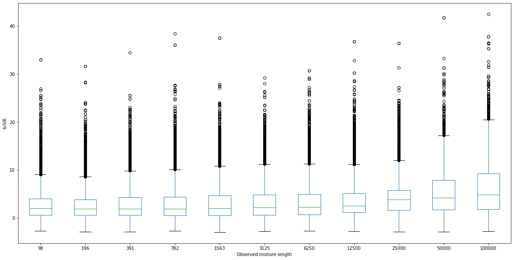

# Discussion {#discussion}

Previous sections have reviewed the TV-SOS model together with Yeredor's original TV-SOBI algorithm, while new approaches of LTV-SOBI and its alternatives are presented, together with a simulation study. Compared with Yeredor's original TVSOBI algorithm, LTV-SOBI eliminates one major problem of estimated covariance matrix being non-positive semi-definite as detailed in Section \@ref(algorithm). Yet, the LTV-SOBI algorithm does not always guarantee a solution and is particularly dependent on the observation. The most significant cause is the computational singularity, while in rather few cases, a negative-definite estimator also prohibits the algorithm of finding the nearest positive-definite matrix and ultimately fails the whole algorithm. Despite the mixing matrix $\boldsymbol \Omega_0$ is assumed to be of full-rank, the non-singularity of every $\boldsymbol \Omega_t$ could not be secured as a result of small valued $\boldsymbol{\mathcal E}$. Sadly, the computational singular issue could occur in almost every step.

As illustrated in Figure \@ref(fig:boxplot), the simulation results indicate probable stability issues. There exists a considerable amount of simulations that yield significantly better results as compared with average (tvSIR $\approx 20$), while there barely exists poor results (tvSIR $< 0$). The issue could arise from both algorithm compatibility and metric robustness. Since $\boldsymbol{\mathcal E}$ is supposed to be small, extreme values can often occur when performing the inverse, and these can also be observed in the restored signal. Neither tvSIR nor tvMD tackles outliers in a robust manner. Furthermore, LTV-SOBI does not provide the option to utilize robust second-order statistics due to its reliance on autocovariance structure in equation \@ref(eq:tvsobi). Stationarity, seasonality, the scale of time-variance, observation length and signal dimension are all possible factors that affect LTV-SOBI's performance. Unfortunately, the exact causes and mechanisms have not been identified thoroughly.

```{r boxplot, fig.show='hold', fig.cap='Boxplot for tvSIR measures in Cohort I simulation when sources are separated by LTV-SOBI', out.width='99%'}



######### replace by screenshot #########
# res %>% 
#   mutate(series = str_sub(id, 12, 15)) %>%
#   filter(criteria == "SIR_diag_sq", N > 90, 
#          method == "LTV-SOBI", lag != 1, series == "E5N5") %>%
#   ggplot(aes(as.factor(N), value)) + geom_boxplot(color = "darkgrey")  +
#   scale_y_continuous(name="tvSIR") +
#   scale_x_discrete(name="Sampling Size") +
#   theme_light()
#########       #########       #########
```

This thesis offers the application, extension, and improvement to Yeredor's original time-varying blind source identification, together with modified BSS metrics, while remarking the challenges in robustness and imperfection of measurement. Further studies would be demanded in terms of tensor observation, consistent performance evaluation and statistical property of TV-SOS results.