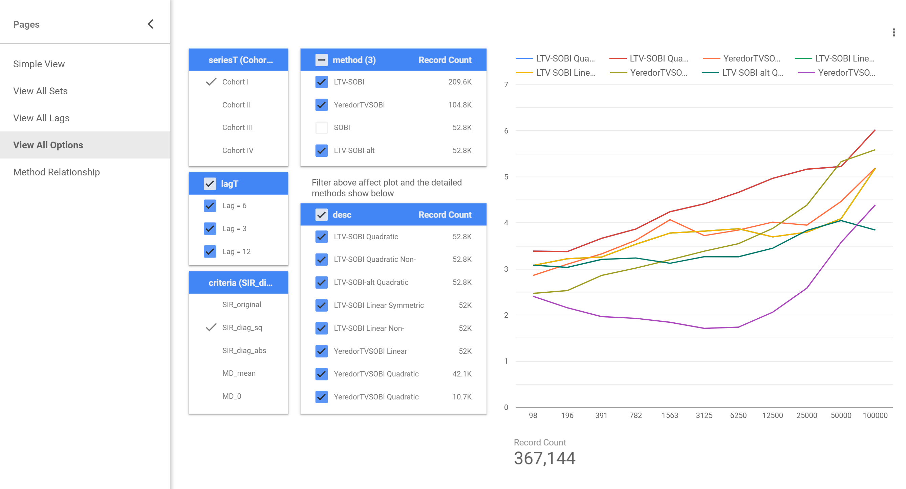

# Appendix {-}

## Implementaion of LTV-SOBI in R {#implementation}

The primary `R`-functions that support LTV-SOBI are listed as following,

- `ltvsobi(x, lags = 12, quadratic = TRUE, fix_symmetry = TRUE, verbose = FALSE)` returns list of class `tvbss` that is compatible with `JADE` pacakges's `bss` class;

- `ltvsobi2(x, lags = 12, quadratic = TRUE, fix_symmetry = TRUE, verbose = FALSE)` implements the LTV-SOBI-alt in the same manner as `ltvsobi`

- `SIR_all(bss_res, Omega, Epsilon, S)` calculates all applicable performance metric, supporting both `tvbss` class and `bss` class;

- `tvmix(z, Omega, Epsilon, x_only = TRUE)` and `tvunmix <- function(x, Omega_hat, Epsilon_hat)` serve as TV-SOS utility that generates/restores time-varying mixture based on source signal and mixing parameters.

For major computer platform, linear estimation is faster and more reliable compared with inverse matrix. Consequently, inversion is minimized in `LTV-SOBI`. It is possible to use a vectorization version of `ltvsobi`, and it indeed reduces the CPU time in processing compared with looping. However, vectorization and Kronecker product significantly raise the dimension of matrices; therefore, the improvement in CPU time is at the cost of RAM usage, which becomes a problem if the dimension is too high and `R` crash might occur. It is advisable to use non-vectorized version for large $p$ and $T$ ($p \geq 10,\ T \geq 50000$). The previous chapters appoint non-vectorization version.

## Introduction to LTV-SOBI Performance Metric Explorer {#explorer}

As Chapter \@ref(performance) stated the complexity in presents LTV-SOBI performance due to large number of factors, an interactive dashboard is designed to enable customizable performance exploring. The explorer is available at http://bss.yan.fi and is programmed in `R` with support of `shiny` package. The explorer allows user to view and compare performance metric from different angles.

```{r explorer, fig.cap='Screeshot of BSS Explorer, an interactive dashboard', out.width='99%', echo = FALSE}

```

## _R_ Code for Simulation Study {#simcode}

```{r appcode, eval = FALSE, echo = TRUE}
remove(list = ls()) # clear environment
path <- paste0(getwd(), "/sim/")
library(tidyverse)
source("rfun.R") # contains algorithms and utilities of LTV-SOBI
source("rsim.R") # contains functions that simulate various sources
source("rlab_x.R") # an implementation of Yeredors' TV-SOBI


# simulation sampling interval --------------------------------------------

do_it_once <- function(x, z, lll = 6, id = "hi", Omega, Epsilon){
  
  for (i in 1:8) {
    flag <- TRUE
    tryCatch({
      if(i == 1) bss_res <- JADE::SOBI(x, k = lll)
      if(i == 2) bss_res <- tvsobi  (x, lag.max = lll, TRUE)
      if(i == 3) bss_res <- tvsobi  (x, lag.max = lll, FALSE)
      if(i == 4) bss_res <- ltvsobi (x, lags = lll, 
                                     quadratic = TRUE,  
                                     fix_symmetry = TRUE)
      if(i == 5) bss_res <- ltvsobi (x, lags = lll, 
                                     quadratic = TRUE,  
                                     fix_symmetry = FALSE)
      if(i == 6) bss_res <- ltvsobi (x, lags = lll, 
                                     quadratic = FALSE, 
                                     fix_symmetry = TRUE)
      if(i == 7) bss_res <- ltvsobi (x, lags = lll, 
                                     quadratic = FALSE, 
                                     fix_symmetry = FALSE)
      if(i == 8) bss_res <- ltvsobi2(x, lags = lll)
    }, error = function(e) {
      print(paste("skip to next method due to", e))
      flag <<- FALSE
    })
    
    if(flag) {
      #save_estimator(bss_res, id) #save_restored(bss_res, id)
      benchmarks <- SIR_all(bss_res, Omega, Epsilon, z)
      remove(bss_res)
      save_eval(benchmarks, id)
    }
  }  
}


save_eval <- function(benchmarks, id){
  df <- NULL
  for(i in 2:length(benchmarks)){
    df <- data.frame(criteria = attributes(benchmarks)$names[i],
                     value    = benchmarks[[i]]) %>% rbind(df, .)
  }
  df$detail = benchmarks$method
  df$method = word(benchmarks$method)
  df$id     = id
  df$desc   = str_remove(benchmarks$method, " NearestSPD")
  df$N      = benchmarks$N
  df$p      = benchmarks$p
  
  df <- df %>% filter(criteria != "N" & criteria != "p")

  Sys.sleep(runif(1))
  fname <- paste0(path, "benchmarks-", id, ".rds")
  if (file.exists(fname)) saveRDS(rbind(readRDS(fname), df), file = fname)
  else  saveRDS(df, file = fname)
}

# boosting ----------------------------------------------------------------

multido <- function(E, N, sn){
  for(i in 1:100){
    Omega <- matrix(c(2, -9, -4, -6, 5, 6, 0.5, 3, 8), ncol =3)
    Epsilon <- 10^(-E) * matrix(c(-3, -4, 9, 
                                  6, 2.5, 2.1, -6, 6, 7), ncol = 3)
    zall <- sim_good_sources(N = 1e4, 3)
    xall <- tvmix(zall, Omega, Epsilon)
    
    # loop for freqs
    freq_list <- 2^(0:10)
    for(freq in freq_list){
      for(l in c(3,6,12,1)){
        ids  <- seq(from = 1, to = nrow(xall), by = freq)
        x <- xall[ids,]
        z <- zall[ids,]
        do_it_once(x, z, lll = l, 
                   id = paste0("seq", sn, "_fixed_freq_E", 
                               E, "N", N, "_Boot_lag", l), Omega, Epsilon)
      }
    }
  }
}


library(parallel)
mclapply(as.list(1:500), function(seq) {
  multido(5,5,seq); multido(5,4,seq);
  multido(4,5,seq); multido(4,4,seq);
})


```