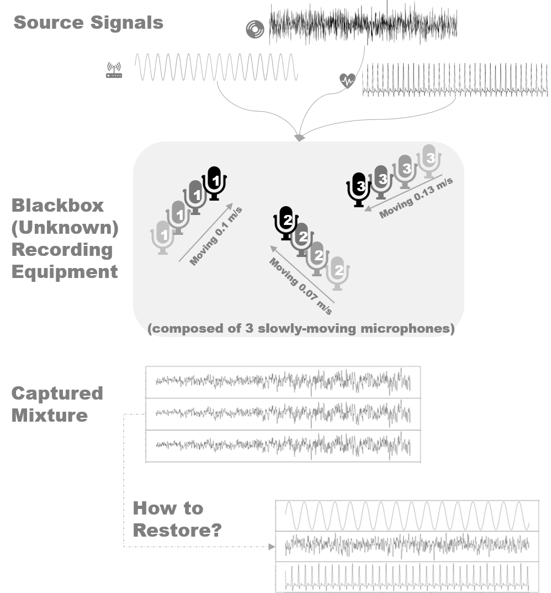

--- 
title: "Time-Varying Source Separation by Joint Diagnolization on Autocovariances"
author: "Yan Pan"
date: "`r Sys.Date()`"
site: bookdown::bookdown_site
documentclass: article
bibliography: 99-ref.bib
biblio-style: apalike
link-citations: yes
description: "LTV-SOBI"
papersize: a4
linestretch: 1.5
always_allow_html: yes
---

# Abstract {-}

Blind source separation (BSS) seeks to recover the true signals from the observed ones, and no prior information (blind) about the mixing matrix is available. There are various methodologies established to solve the BSS problems, and notably, Second-Order Blind Identification (SOBI) identifies sources through spatial independence in second-order statistics. This thesis stretches the Second Order Source Separation (SOS) model in terms of latent time variation in mixing mechanism that was initially proposed by Yeredor (2003). An improved algorithm, Linearly Time-Varying SOBI (LTV-SOBI), together with alternatives attempts to estimate mixing parameters and ultimately derives the latent independent sources by means of autocovariance decomposition and joint diagonalization. The performance of LTV-SOBI is analyzed with simulated data by extending the performance metric Signal-to-interference ratio (SIR) into the time-varying case. Mass simulation suggests the superiority of the new LTV-SOBI algorithm compared with Yeredor's TV-SOBI algorithm, despite overall results are still non-optimal. In addtion to the full implementation of LTV-SOBI algorithm in _R_, an interactive dashboard is designed to enable further investiagtion of algorithm performance.

# Tiivistelmä {-}

Sokealähdeerottaminen (Blind Source Separation, BSS) pyritään palauttamaan todelliset signaalit havaituista, joista ei mitään aikaisempaa tietoa (sokea) sekoitusmatriisista ole saatavilla. BSS:n ratkaisut ovat perustettu useita menetelmiä, ja etenkin toisen asteen sokeatunnistaminen (SOBI) tunnistaa lähteet alueellisen riippumattomuuden ja toisen asteen tilastojen avulla. Tämän tutkimuksen tarkoituksena on laajentaa toinen asteen lähdeerottamismalli (Second Order Souce Separation, SOS) suhteen aikavaihtelevan sekoitusmekanismin tapauksessa, jonka Yeredor (2003) ehdotti alun perin. Parannettu algoritmi, eli lineaarisesti aikavaihteleva SOBI (linearly time-varying SOBI, LTV-SOBI) ja sen vaihtoehtoja yrittää estimoida sekoitusparametreja ja johtaa lopulta piilevät riippumattomat lähteet autokovarianssin hajoamisen ja yhteisdiagonaalin avulla. LTV-SOBI:n suorituskykyä analysoidaan simuloidulla datalla laajentamalla suorituskykymetriikka Signaali-kohinasuhde aikavaihtelevan tapaukseen. Massasimulaatio esittää uuden LTV-SOBI-algoritmin paremmuuteen verrattuna Yeredorin TV-SOBI, vaikka kokonaistulokset eivät ole vielä optimaalisia. LTV-SOBI-algoritmi on toteutettu kokonaan _R_:ssä ja sen lisäksi, että interaktiivinen kojetaulu on tehty algoritmien suorituskyvyn tutkimiseksi edelleen.

<!--chapter:end:index.Rmd-->

# Introduction {#intro}

Imagine a situation that a small musical band composed of a piano, a bass, and a drum is playing at the stage, while 3 microphones are recording its performance. Rather than each microphone records one specific instrument, it can be expected that each captures a slightly different mixture of the original sounds from the trio. In a real-world situation, there exist diversified needs for extracting structured information from observable mixtures of unknown signals. For example, a recording of speech may contain external noise from nearby road traffic, minor discussion among the audience and constant electronic interference in addition to the speech voice itself. 

In most cases, the mixing mechanism is unclear or too costly to measure, and thus it arises a set of statistical problem to seek restoration of source signals given observed ones based on a certain proper statistical assumption - independence as an example. Further, the mixing mechanism is not necessarily static; in recording, the microphones can be moving slowly towards or against the artists due to some relative movement (dancing, walking, etc.). Figure \@ref(fig:algorithm) provides a simple illustration of the BSS problem.

```{r illustration, fig.cap='Illustration of Blind Source Separation with Time-varying Factor', out.width='90%', echo = FALSE}

```

Blind Source Separation (BSS) is a set of unsupervised machine learning algorithms in terms of input being only a single data matrix. The characteristics of output usually cannot be accurately foreseen in advance due to lack of other relevant evidence and such algorithms mostly serve as exploratory purposes [@hyvarinen2013independent]. Compared with supervised learning like regression and classification tree, unsupervised ones are more challenging and has a tendency to be more subjective in the absence of a clear goal. Nevertheless, BSS and other exploratory data analysis gain increasing importance especially in online marketing and healthcare industry [@james2013introduction]. The modern information technology grants the massive quantity of data, but subtracting structural insights could be an enormous challenge. The "blind" approaches endeavor to provide a unique perspective of data if computation resources are sufficiently available with rather limited human interferences.

This thesis expands the static source separation problem into linearly time-varying one that developed from previous researches, employing relatively modern tools. A functional full implementation and associated utilities in `R` will be produced. Proceeding sections will first formulate the BSS problems and review established solutions, and then elaborate the linearly time-varying structure of second-order source separation. Chapter \@ref(tvsobi) presents the new algorithm in detail, followed by performance measurement. Finally, the thesis shall be concluded with a discussion of potential extension and performance-related topics.

Vectors and matrices are always marked as bold symbols while a lower case letter stands for a real-valued number. The most commonly used symbols are summarized below.

Table 1: Notation

| Symbol | Meaning | Note |
|---|---|---|
| $\boldsymbol I$ | identity matrix| compatible dimensions are assigned|
| $\boldsymbol z$ | source signals| $p\times T$ matrix or $p$-vector; a realization of (unobservable) stochastic process $(Z_t)$ |
| $\boldsymbol x$ | observed signals| $p\times T$ matrix or $p$-vector; a realization of (unobservable) stochastic process $(X_t)$ |
| $\boldsymbol\mu$ | row means of a matrix   |  vector  |
| $\boldsymbol\Omega_t$ | mixing matrix at given time point $t$ | $p\times p$ matrix. $\boldsymbol\Omega_t = ( \boldsymbol I+t \boldsymbol{\mathcal E}) \boldsymbol\Omega$ |
| $\boldsymbol\Omega$ | mixing matrix at $t=0$ | $\boldsymbol\Omega \overset{\text{def}}= \boldsymbol\Omega_0$ |
| $\boldsymbol{\mathcal E}$ |time-varying mixing factor | $p\times p$ matrix |
| $\boldsymbol\Lambda_{\tau}$ | autocovariance given stationarity | $p\times p$ matrix that depends only on lag $\tau$ and assumed to be diagonal |
| $\boldsymbol R_{\tau} = \boldsymbol{\Omega \Lambda}_{\tau} \boldsymbol\Omega'$ | partially mixed autocovariance  | $p\times p$, a short-hand notation|
| $\boldsymbol K ^{(p,p)}$ | commutation matrix | $p^2\times p^2$ |
| $t=1,2,\dots,T$ | index of time | use in subscript. $t=0$ is a pseudo notation and $t=1,\ t=T$ are the first and last observation in the time series correspondingly | 
| $\tau \in \{0\}\bigcup L$ | pre-selected time lag | An integer. 0 is included for covenience |
| $L = \{\tau_1,\tau_2,\dots,\tau_l\}$ | set of pre-selected lags | $l$-item set of positive integers |
| Operator $\boldsymbol{A}'$ |  matrix transpose of $\boldsymbol A$| |
| Subscript $\boldsymbol{A}_t$  | the $t$-th column vector of $\boldsymbol{A}$ | observation at time $t$ |
| Function $\text{vec}( \boldsymbol A)$ | vectorization (by-column) of $\boldsymbol A$ | |
| Operator $\otimes$ | Kronecker product | |
| Index $\boldsymbol{A}[i,j]$ | value at the $i$-th row $j$-th column of matrix $\boldsymbol{A}$ | |

<!--chapter:end:01-intro.Rmd-->

# Blind Source Separation {#sobi}

Blind Source Separation (BSS) assumes a set of individual source signal $\boldsymbol{z}=(\boldsymbol{z}_1, \boldsymbol{z}_2,\dots,\boldsymbol{z}_p)'$ mixed by a $p\times p$ matrix $\boldsymbol{\Omega}$ and thus produce the mixture $\boldsymbol{x}=(\boldsymbol{x}_1, \boldsymbol{x}_2,\dots,\boldsymbol{x}_p)'$, where the signals themselves can be multidimensional. The mixing mechanism satisfies $\boldsymbol x = \boldsymbol \mu + \boldsymbol\Omega \boldsymbol z$, where $\boldsymbol\mu$ stands for some static location, for example the mean value [@belouchrani1997blind]. Without loss of generality, it can be further assumed that $\boldsymbol x$ embeds the zero-mean property, which can be always achieved through substracting the mean from the mixture. Therefore, the mixing is simplified to $\boldsymbol x = \boldsymbol\Omega \boldsymbol z$

Although mathematically unnecessary, $\boldsymbol{\Omega}$ is defined as a full-rank $p\times p$ matrix. In fact, a decrease in dimension of $\boldsymbol{\Omega}$ will allow fewer signal series (number of rows in $\boldsymbol z$) generated from the same mixture $\boldsymbol{x}$. However, it is not necessary due to the fact that the output carries real-world information, and the usefulness of series would be better determined using evidence of the signal itself. Consequently, it is a justified choice to force the mixing matrix to be full-rank.

The goal of BSS is to restore the source signals based on observable mixture, and the above model assures that finding mixing matrix $\boldsymbol{\Omega}$ or unmixing matrix $\boldsymbol{W}= \boldsymbol{\Omega}^{-1}$ suffices, where the model assumption of full rank guarantees the existence of inverse matrix. For notation simplification and clarity, the following paragraphs shall only use $\boldsymbol\Omega$. 

## Ambiguities and Assumptions

The BSS equation \@ref(eq:SOM) underlies the impossibility to solve $\boldsymbol\Omega$ and $\boldsymbol z$ in a finite closed form because of merely one known item, and thus BSS solution always incurs [@belouchrani1997blind],

- Permutation ambiguity: the $a$-th series of signal may be confused into $b$-th series in the restored one; however, they are always 1-1 mapping after sign-correction. The permutation can also include sign ambiguity.
- Scale ambiguity: restore signals can be scaled due to the fact that for any (unknown) scale constant $||a||:\ \boldsymbol x \equiv \big(\boldsymbol\Omega ||a||^{-1} \big) \big(||a|| \boldsymbol z \big)$.

Figure \@ref(fig:ambiguity) illustrates the ambiguity. The observed source is a 4-dimensional signal combining auto-regressive, moving average, sinusoidal and ECG-style time series. Comparing left and right plot, observation series 2 is clearly mapped into series 1 in restored signals, while series 4 become series 2. Although the shape and waveform are very similar, the scale of the y-axis intimates the scale ambiguity.

```{r ambiguity, fig.show='hold', fig.cap='Observed vs. restored sources', out.width='50%', echo = FALSE}
load("thesis.rdata")
library(tidyverse)
plot.ts(fig_mixing$source, main = "Observed Source",      ann = FALSE)
plot.ts(fig_mixing$unmix,  main = "SOBI Restored Source", ann = FALSE)
```

There exist different approaches to solve the BSS problem in terms of identifying the mixing matrix and source signal series. Notably, the Independence Component Analysis (ICA) algorithm assumes statistical independence of between series and nongaussian distribution within series, in addition to the optional setting of component number equality between source and mixture [@comon1994independent].


## Stationary Time-Series Source Separation Using Autocovariance Matrices

In information processing, the signals are usually recorded by highly precise measurement instruments at a given time interval, and thus arose the natural time-series data structure. Assuming pre-centered data, the time series observation can be easily adapted to the basic form \@ref(eq:SOM) by introducing the temporal subscript of $t=1,2,\dots, T$ as $\boldsymbol{x}_t = \boldsymbol{\Omega z}_t$. Focusing on the autocovariance matrices, a second order statistics, the second order source separation (SOS) model seeks to extract the original source signals based mainly on uncorrelatedness Furthermore, the source signals are assumed to be weakly stationary, implying that the autocovariance matrices vary only on the lag $\tau$ but not on the time of observation $t$, which mathematically express as $\mathbb E (\boldsymbol z_t \boldsymbol z_{t+\tau}')$ are constant given $\tau$ for all $t=1,2,\dots,T$. The SOS model assumes the discrete stochastic process $(\boldsymbol Z_t)_{t=0,\pm1, \pm2}$ as source signals and the mixture $(\boldsymbol X_t)_{t=0,\pm1, \pm2}$ such that [adapted @miettinen2016separation],

\begin{equation}
\begin{aligned} 
\boldsymbol X_t = \boldsymbol{\Omega}\boldsymbol Z'_t,\ \ &\ t=0,\pm 1,\pm2,\dots
\\ \text{satisfies }(A1)\ & \mathbb E( \boldsymbol Z_t) = \boldsymbol 0 
\\ (A2)\ & \mathbb E( \boldsymbol Z_t \boldsymbol Z_t') = \text{Cov}( \boldsymbol Z_t) = \boldsymbol I_p
\\ (A3)\ & \mathbb E( \boldsymbol Z_t \boldsymbol Z_{t+\tau}') = \boldsymbol\Lambda_\tau \text{ diagonal for all } \tau = 1,2,\dots
\end{aligned}    
(\#eq:SOS)
\end{equation}

Give realization of the stochastic progress, this semi-parametric model become $\boldsymbol x_t = \boldsymbol\Omega \boldsymbol z_t$ and can thus be solved by joint optimization for the diagonal properties in assumption 3 under the restriction of assumption 2 in \@ref(eq:SOS), which become a unique constrained optimization using Lagrange method after proper whitening and/or normalization procedures [@miettinen2016separation]. 

The Second Order Blind Identification (SOBI) solves the BSS problem using second-order statistics when the true signal follows SOS model, and commonly autovariance matrices and the robust corresponder are applied [@belouchrani1997blind; @nordhausen2014robustifying]. The major second-order blind source separation approaches include AMUSE (Algorithm for Multiple Unknown Signals Extraction) by Tong, Soon, Huang and Liu [-@tong1990amuse] and Second Order Blind Identification, commonly know as SOBI, that originally proposed by Belouchrani, Abed-Meraim, Cardoso and Moulines [-@belouchrani1997blind]. Nordhausen [-@nordhausen2014robustifying] expanded the algorithm to non-stationary time series using locally stationary intervals and further robustifying with average spatial-sign autocovariances on such intervals.


<!--chapter:end:02-sobi.Rmd-->

# Time-Varying Second-Order Model Formulation and Yeredor's Solution {#tvsobi}

Presented earlier by Yeredor [-@yeredor2003tv], Time-varying Second-Order Source Separation (TV-SOS) here refers to the existence of slow change in mixing matrix $\boldsymbol{\Omega}$. Within the SOS model \@ref(eq:SOS), linear time variation can be represented as $\boldsymbol\Omega_t = (\boldsymbol I + t \boldsymbol{\mathcal E})\boldsymbol\Omega_0$, which is clearly non-constant despite $\boldsymbol{\mathcal E}$ and $\boldsymbol\Omega_0$ are. The initial mixing $\boldsymbol \Omega_0$ is the $p\times p$ mixing matrix at time $t=0$, and it can be pseudo if time indices are specified to be $t=1,2,3,\dots$; the time-varying factor $\boldsymbol{\mathcal E}$ is another $p\times p$ matrix that measures the scale of linear variation in mixing matrix over the change of time. Other time-varying structure including periodical [@weisman2006separation], geometric curved [@kaftory2007probabilistic], etc. Figure \@ref(fig:mixingplot) illustrates the difference between an ordinary time-invariant mixture and linearly time-varying one. It can be discovered that the time-varying mixture has a certain trend and it does not demonstrate the stationary property. In fact, the introduction of time-varying factor invalids the stationary property in the observation $\boldsymbol{x}$ almost surely even though the source signals are stationary. This is because $\boldsymbol{\mathcal E}$ changes the scale (second-order statistics) over time $t$. Nevertheless, the aforementioned SOBI and the upcoming LTV-SOBI algorithms do not require such property in observation.

```{r mixingplot, fig.show='hold', fig.cap='Two types of 4-dimensional signal mixture example: ordinary mixing (left) and time-varying mixing (right).', out.width='50%', echo = FALSE}
load("thesis.rdata")
plot.ts(fig_mixing$mix,    main = "Ordinary Mixture",     ann = FALSE)
plot.ts(fig_mixing$tvmix,  main = "Time-varying Mixture", ann = FALSE)
```

## TV-SOS Model and Assumptions

TV-SOS model serves as an extension to the SOS model \@ref(eq:SOS) and also a special case of general-TV-SOS where the time-dependent variation is assumed to be linear.A realization (observation) of TV-SOS is defined as,

\begin{equation}
\begin{aligned}
\boldsymbol x_t =  ( \boldsymbol I + t \boldsymbol{\mathcal E})\boldsymbol \Omega_0 \boldsymbol  z_t
\\ (B1)\ & \mathbb E( \boldsymbol z_t) = \boldsymbol 0 
\\ (B2)\ & \mathbb E( \boldsymbol z_t \boldsymbol z_t') = \text{Cov}( \boldsymbol z_t) = \boldsymbol I
\\ (B3)\ & \mathbb E( \boldsymbol z_t \boldsymbol z_{t+\tau}') = \boldsymbol\Lambda_\tau \text{ diagonal for all }
\tau = 1,2,\dots
\\ (B4*)\ & \boldsymbol{\mathcal E} << \boldsymbol I 
\end{aligned}
(\#eq:tvsobi)
\end{equation}

Similar to SOS, the first assumption is non-restrictive and can be achieved through simple data transformation; the second is required to tackle the ambiguity of BSS, while the third assumption states both stationary and uncorrelated characteristics. The final and optional assumption ensures that the change of mixing is rather slow, and otherwise, the mixture is not a meaningful BSS problem [adapted @yeredor2003tv]. It should be noted that the model assumes uncorrelatedness instead of independence in pre-centered source signals, formally, the Pearson correlation between different series are always $0$, or $\mathbb E[\boldsymbol x_i \boldsymbol x_j] = 0$ for all $i\neq j$. It is a relatively less-restrictive condition as independence implies uncorrelatedness, while the opposite is not true in general [e.g. @papoulis2002probability].

## Yeredor's TV-SOBI Algorithm

TV-SOBI is the original algorithm provided by Yeredor [-@yeredor2003tv] solves the above TV-SOS model. The algorithm first finds the approximate 3-item expression of autocovariances as \@ref(eq:ycovs),

\begin{equation}
\begin{aligned}
\mathbb E(\boldsymbol x_t \boldsymbol x_{t+\tau}') & = \mathbb E[( \boldsymbol I + t \boldsymbol{\mathcal E}) \boldsymbol\Omega_0 \boldsymbol z_t \ \boldsymbol z_{t+\tau}' \boldsymbol\Omega_0' [ \boldsymbol I + (t + \tau) \boldsymbol{\mathcal E}]']
\\ &= \boldsymbol\Omega_0 \boldsymbol\Lambda_\tau \boldsymbol \Omega_0'
 + t ( \boldsymbol{\mathcal E} \boldsymbol\Omega_0 \boldsymbol\Lambda_\tau \boldsymbol \Omega_0' +  \boldsymbol\Omega_0 \boldsymbol\Lambda_\tau \boldsymbol \Omega_0' \boldsymbol{\mathcal E}')
 + t^2 ( \boldsymbol{\mathcal E} \boldsymbol\Omega_0 \boldsymbol\Lambda_\tau \boldsymbol \Omega_0' \boldsymbol{\mathcal E}')
\\ &\ \ \ \ \ \  + \tau ( \boldsymbol{\mathcal E} \boldsymbol\Omega_0 \boldsymbol\Lambda_\tau \boldsymbol \Omega_0')
+ t \tau ( \boldsymbol{\mathcal E} \boldsymbol\Omega_0 \boldsymbol\Lambda_\tau \boldsymbol \Omega_0' \boldsymbol{\mathcal E}')
\\ &= \underline {\boldsymbol\Omega_0 \boldsymbol\Lambda_\tau \boldsymbol \Omega_0'}
 + t (\underline{ \boldsymbol{\mathcal E} \boldsymbol\Omega_0 \boldsymbol\Lambda_\tau \boldsymbol \Omega_0'  +  \boldsymbol\Omega_0 \boldsymbol\Lambda_\tau \boldsymbol \Omega_0' \boldsymbol{\mathcal E}'})
\\ &\ \ \ \ \ \  + t(t+\tau) ( \underline{\boldsymbol{\mathcal E} \boldsymbol\Omega_0 \boldsymbol\Lambda_\tau \boldsymbol \Omega_0' \boldsymbol{\mathcal E}'}) + \tau ( \underline {\boldsymbol{\mathcal E} \boldsymbol\Omega_0 \boldsymbol\Lambda_\tau \boldsymbol \Omega_0'})
\\ & \approx \boldsymbol\Omega_0 \boldsymbol\Lambda_\tau \boldsymbol \Omega_0'
 + t ( \boldsymbol{\mathcal E} \boldsymbol\Omega_0 \boldsymbol\Lambda_\tau \boldsymbol \Omega_0' +  \boldsymbol\Omega_0 \boldsymbol\Lambda_\tau \boldsymbol \Omega_0' \boldsymbol{\mathcal E}')
 + t^2 ( \boldsymbol{\mathcal E} \boldsymbol\Omega_0 \boldsymbol\Lambda_\tau \boldsymbol \Omega_0' \boldsymbol{\mathcal E}')
\\ &:= \boldsymbol R ^{(1)}_\tau + t\, \boldsymbol R ^{(2)}_\tau + t^2\, \boldsymbol R ^{(3)}_\tau
\end{aligned}
(\#eq:ycovs)
\end{equation}

where the underline means that the items will be considered as a whole in later steps and all proceeding chapters. Since $\boldsymbol{\mathcal E}$ is assumed to be rather small in quantity, the items $\tau ( \boldsymbol{\mathcal E} \boldsymbol\Omega_0 \boldsymbol\Lambda_\tau \boldsymbol \Omega_0')$ and $t \tau ( \boldsymbol{\mathcal E} \boldsymbol\Omega_0 \boldsymbol\Lambda_\tau \boldsymbol \Omega_0' \boldsymbol{\mathcal E}')$ would also be small due to it scale transformation by $\boldsymbol{\mathcal E}$, and Yeredor therefore argues their negligibility.

Then, Yeredor tried to estimate the $p\times p$ matrices of $\boldsymbol R ^{(1)}_l,\ \boldsymbol R ^{(2)}_l$ and $\boldsymbol R ^{(3)}_l$ through a linear least square model. The model is achieved by casting matrix equation \@ref(eq:ycovs) to element-wise real-valued equation of,

\begin{equation}
\begin{bmatrix} \boldsymbol x_1 \boldsymbol x_{1+\tau}'\ [i,j] \\ \boldsymbol x_2 \boldsymbol x'_{2+\tau}\ [i,j] \\ \vdots \\ \boldsymbol x_{T-\tau} \boldsymbol x_{T}'\  [i,j]\end{bmatrix}
= \begin{bmatrix} 1 & 1 & 1^2 \\  1 & 2 & 2^2  \\ \vdots &\vdots &\vdots \\  1 & T-\tau & T^2  \end{bmatrix}
\begin{bmatrix} \boldsymbol R ^{(1)}_\tau [i,j] \\ \boldsymbol R ^{(2)}_\tau [i,j] \\ \boldsymbol R ^{(3)}_\tau [i,j]   \end{bmatrix} + \text{residuals}
(\#eq:ycovmat)
\end{equation}

The LS-estimation leads to,

\begin{equation}
\begin{bmatrix} \widehat{\boldsymbol R ^{(1)}_\tau} [i,j] \\ \widehat{\boldsymbol R ^{(2)}_\tau} [i,j] \\ \widehat{\boldsymbol R ^{(3)}_\tau} [i,j]   \end{bmatrix}
= \begin{pmatrix}\begin{bmatrix} 1 & 1 & 1^2 \\  1 & 2 & 2^2  \\ \vdots &\vdots &\vdots \\  1 & T-\tau & T^2  \end{bmatrix}' \begin{bmatrix} 1 & 1 & 1^2 \\  1 & 2 & 2^2  \\ \vdots &\vdots &\vdots \\  1 & T-\tau & T^2  \end{bmatrix}   \end{pmatrix} ^{-1} \begin{bmatrix} 1 & 1 & 1^2 \\  1 & 2 & 2^2  \\ \vdots &\vdots &\vdots \\  1 & T-\tau & T^2  \end{bmatrix}'
\begin{bmatrix} \boldsymbol x_1 \boldsymbol x_{1+\tau}'\ [i,j] \\ \boldsymbol x_2 \boldsymbol x'_{2+\tau}\ [i,j] \\ \vdots \\ \boldsymbol x_{T-\tau} \boldsymbol x_{T}'\  [i,j]\end{bmatrix}
\end{equation}

Yeredor [-@yeredor2003tv] proposed a practical approach to optimize best solution for $\boldsymbol \Omega_0$ and $\boldsymbol{\mathcal E}$. Denote the whitening matrix $\boldsymbol W = \big( \widehat{\boldsymbol R^{(1)}_0} \big)^{-\frac 1 2}$ and the idea is to use sequential Jacobi rotations to optimize,

\begin{equation}
\min\limits_{V,\Lambda_{\tau_1}, \dots, \Lambda_{\tau_l}} \bigg( \sum\limits_{\tau=\tau_1}^{\tau_l} || \boldsymbol W \widehat{\boldsymbol R^{(1)}_\tau} \boldsymbol W' - \boldsymbol {V \Lambda}_\tau \boldsymbol \Lambda'||^2 \bigg)
\end{equation}

where $\Lambda_{\tau_1}, \dots, \Lambda_{\tau_l}$ are diagonal, and the exact value are unknown. The optimization algrithm only utilizes the property of being diagonal, and the values will become available only after the optimization. In addition, the other paramter $\boldsymbol{\mathcal E}$ can be found through optimization, 

\begin{equation}
\min\limits_{ \boldsymbol{\mathcal E} } \bigg( \sum\limits_{\tau=\tau_1}^{\tau_l} || \widehat{\boldsymbol R^{(2)}_\tau} - \boldsymbol{\mathcal E} \widehat{\boldsymbol R^{(1)}_\tau} - \widehat{\boldsymbol R^{(1)}_\tau} \boldsymbol{\mathcal E}' ||^2 \bigg)
\end{equation}

Finally, Yeredor's TV-SOBI concludes with $\widehat{\boldsymbol \Omega_0} = \boldsymbol W ^{-1} \boldsymbol V$ and $\widehat{ \boldsymbol{\mathcal E}}$. It can be noticed in the optimization steps that the value of $\boldsymbol R ^{(3)}_{\tau}$ is not used. In fact, Yeredor even provided an alternative that excludes it from \@ref(eq:ycovs). Nonetheless, $\boldsymbol R ^{(3)}_{\tau}$ is closely associating with $\boldsymbol R ^{(1)}_{\tau}$ and $\boldsymbol R ^{(2)}_{\tau}$ as in Equation \@ref(eq:ycovmat), suggesting that inclusion or exclusion would indeed affect on the output of TV-SOBI. It is indeed theoretically possible to include the expression of $\boldsymbol R ^{(3)}_{\tau}$ in optimization procedures, but it would be too complicated to find a solution, and the relatively naive approach described above is sufficient to solve the BSS problem.

<!--chapter:end:03-tvsobi.Rmd-->

#  Algorithm Linearly Time-Varying Second Order Blind Identification {#algorithm}

While SOS model can be identified by obtaining one single matrix ($\boldsymbol\Omega$), TV-SOS demands at least one more matrix to be effectively estimated, the linear time-varying mixing factor $\boldsymbol{\mathcal E}$ in addition to the pseudo initial mixing matrix $\boldsymbol{\Omega}_0$.

Developed from Yeredor[-@yeredor2003tv]'s original TV-SOBI, this section carefully investigates the autocovariance matrices and introduces the new Linearly Time-Varying Second Order Blind Identification (LTV-SOBI) algorithm pursuing better mathematical accuracy given TV-SOS model \@ref(eq:tvsobi).  LTV-SOBI mainly includes 3 statistical steps using empirical autocovariance matrices and applying joint diagonalization after applicable decomposition. Various matrix operation is applied in all steps.

Similar to model fitting in time series analysis, the desired lags must be chosen in advance based on the data characteristics (for example with the help of `acf` function), and suppose $L = \{\tau_1, \tau_2,\dots, \tau_{l}\}$ are the set of pre-defined lags. For convenience, let $\tau\in\{0\} \bigcup L$

## Decomposition of Autocovariance Structure {#step1}

Being a second-order approach, the LTV-SOBI algorithm is based on the autocovariances of pre-centered observation. As previously demonstrated in Equation \@ref(eq:ycovs), the autocovariances are

\begin{equation} 
\begin{aligned}
\mathbb E(\boldsymbol x_t \boldsymbol x_{t+\tau}') & = \mathbb E[( \boldsymbol I + t \boldsymbol{\mathcal E}) \boldsymbol\Omega_0 \boldsymbol z_t \ \boldsymbol z_{t+\tau}' \boldsymbol\Omega_0' [ \boldsymbol I + (t + \tau) \boldsymbol{\mathcal E}]']
\\ &= \underline {\boldsymbol\Omega_0 \boldsymbol\Lambda_\tau \boldsymbol \Omega_0'}
 + t (\underline{ \boldsymbol{\mathcal E} \boldsymbol\Omega_0 \boldsymbol\Lambda_\tau \boldsymbol \Omega_0'  +  \boldsymbol\Omega_0 \boldsymbol\Lambda_\tau \boldsymbol \Omega_0' \boldsymbol{\mathcal E}'})
\\ &\ \ \ \ \ \  + t(t+\tau) ( \underline{\boldsymbol{\mathcal E} \boldsymbol\Omega_0 \boldsymbol\Lambda_\tau \boldsymbol \Omega_0' \boldsymbol{\mathcal E}'}) + \tau ( \underline {\boldsymbol{\mathcal E} \boldsymbol\Omega_0 \boldsymbol\Lambda_\tau \boldsymbol \Omega_0'})
\end{aligned}
(\#eq:covs)
\end{equation}

The assumption of stationarity has been applied above as $\boldsymbol \Lambda_\tau = \mathbb E[ \boldsymbol z_ t \boldsymbol z_{t+\tau}']$ holds for all $\tau\in L$ and not dependent on any $t=1,2,\dots, T-\tau$. Instead of Yeredor's approximation methodology, the proposed LTV-SOBI algorithm seeks to improve accuracy by persevering all terms in autocovariance matrices. 

After decomposition, the observation is summarized in to $l+1$ matrices of autocovariance; the same quantity of pre-selected lags plus the covariance matrices $\mathbb E( \boldsymbol x_t \boldsymbol x_t')$. Consider element-wise equivalence, for $i,j=1,2,…,p$, the autocovariance structure in \@ref(eq:covs) is equivalent to $\boldsymbol S_\tau = \boldsymbol H^*_\tau \boldsymbol \beta^*_\tau$ defined as,

\begin{equation}
\underbrace{\begin{bmatrix} \boldsymbol x_1 \boldsymbol x_{1+\tau}'\ [i,j] \\ \boldsymbol x_2 \boldsymbol x'_{2+\tau}\ [i,j] \\ \vdots \\ \boldsymbol x_{T-\tau} \boldsymbol x_{T}'\  [i,j]\end{bmatrix}}_{:= \boldsymbol S_\tau}
= \underbrace {\begin{bmatrix} 1 & 1 & 1(1+\tau) &\tau\\  1 & 2 & 2(2+\tau) &\tau \\ \vdots &\vdots &\vdots &\vdots\\  1 & T-\tau & (T-\tau)T &\tau \end{bmatrix}} _ {:= \boldsymbol H^*_\tau}  
\underbrace {\begin{bmatrix} (\boldsymbol\Omega_0\boldsymbol\Lambda_\tau  \boldsymbol\Omega_0') \ [i,j]\\ ({\boldsymbol{\mathcal E}\, \boldsymbol\Omega_0\boldsymbol\Lambda_\tau  \boldsymbol\Omega_0' + \boldsymbol\Omega_0\boldsymbol\Lambda_\tau  \boldsymbol\Omega_0' \, \boldsymbol{\mathcal E}'})\ [i,j]\\ ({ \boldsymbol{\mathcal E}\, \boldsymbol\Omega_0\boldsymbol\Lambda_\tau  \boldsymbol\Omega_0' \, \boldsymbol{\mathcal E}'}) \ [i,j]  \\ ( {\boldsymbol\Omega_0\boldsymbol\Lambda_\tau  \boldsymbol\Omega_0' \, \boldsymbol{\mathcal E}'}) \ [i,j]\end{bmatrix}} _ {:= \boldsymbol \beta^*_\tau}
(\#eq:covmatx)
\end{equation}

Now that the $p$-vector $\boldsymbol{x}$ is the only available observation, it seems that element-wise linear regression is a simple but practical solution to decompose the autocovariances into the structure as in \@ref(eq:covs). The challenge of equation \@ref(eq:covmatx) is that the last column of $\boldsymbol H^*_\tau$ is constant given $\tau$ and fortunately, the modified form in \@ref(eq:covmat) can comfortably tackle it, where the fourth in $\boldsymbol \beta^*_\tau$ are merged into the first row within the same matrix.

\begin{equation}
\underbrace{\begin{bmatrix} \boldsymbol x_1 \boldsymbol x_{1+\tau}'\ [i,j] \\ \boldsymbol x_2 \boldsymbol x'_{2+\tau}\ [i,j] \\ \vdots \\ \boldsymbol x_{T-\tau} \boldsymbol x_{T}'\  [i,j]\end{bmatrix}}_{:= \boldsymbol S_\tau}
= \underbrace {\begin{bmatrix} 1 & 1 & 1(1+\tau) \\  1 & 2 & 2(2+\tau)  \\ \vdots &\vdots &\vdots \\  1 & T-\tau & (T-\tau)T  \end{bmatrix}} _ {:= \boldsymbol H_\tau}  
\underbrace {\begin{bmatrix} (\boldsymbol\Omega_0\boldsymbol\Lambda_\tau  \boldsymbol\Omega_0' + \tau {\boldsymbol\Omega_0\boldsymbol\Lambda_\tau  \boldsymbol\Omega_0' \, \boldsymbol{\mathcal E}'}) \ [i,j]\\ ({\boldsymbol{\mathcal E}\, \boldsymbol\Omega_0\boldsymbol\Lambda_\tau  \boldsymbol\Omega_0' + \boldsymbol\Omega_0\boldsymbol\Lambda_\tau  \boldsymbol\Omega_0' \, \boldsymbol{\mathcal E}'})\ [i,j]\\ ({ \boldsymbol{\mathcal E}\, \boldsymbol\Omega_0\boldsymbol\Lambda_\tau  \boldsymbol\Omega_0' \, \boldsymbol{\mathcal E}'}) \ [i,j]  \end{bmatrix}} _ {:= \boldsymbol \beta_\tau}
(\#eq:covmat)
\end{equation}

Therefore, a proper linear regression can be applied for each $i,j = 1,2,\dots,p$ and $\tau\in\{0\}\cup L$ in the form of $\boldsymbol S_\tau[i,j] = \boldsymbol H_\tau[i,j] \boldsymbol\beta_\tau[i,j]$, where $\boldsymbol S_\tau$ are known from observation and $\boldsymbol H_\tau$ are design matrix; ultimately, matrices of $\boldsymbol\beta_\tau$ are fully estimated in an element-wise manner after looping. For better efficiency, the vectorization form is highly recommended as detailed in \@ref(eq:covvec).

\begin{equation}
\underbrace{\begin{bmatrix} \text{vec}(\boldsymbol x_1 \boldsymbol x_{1+\tau}') \\ \text{vec}(\boldsymbol x_2 \boldsymbol x'_{2+\tau}) \\ \vdots \\ \text{vec}(\boldsymbol x_{T-\tau} \boldsymbol x_{T}')\end{bmatrix}}_{:= \text{vec}(\boldsymbol S_\tau)}
= \underbrace {\begin{bmatrix} 1 & 1 & 1(1+\tau) \\  1 & 2 & 2(2+\tau)  \\ \vdots &\vdots &\vdots \\  1 & T-\tau & (T-\tau)T  \end{bmatrix} \otimes \boldsymbol I_{p^2}} _ {:= \boldsymbol H_\tau \otimes \boldsymbol I_{p^2}}  \ \
\underbrace {\begin{bmatrix} \text{vec}(\boldsymbol\Omega_0\boldsymbol\Lambda_\tau  \boldsymbol\Omega_0' + \tau {\boldsymbol\Omega_0\boldsymbol\Lambda_\tau  \boldsymbol\Omega_0' \, \boldsymbol{\mathcal E}'}) \\ \text{vec}({\boldsymbol{\mathcal E}\, \boldsymbol\Omega_0\boldsymbol\Lambda_\tau  \boldsymbol\Omega_0' + \boldsymbol\Omega_0\boldsymbol\Lambda_\tau  \boldsymbol\Omega_0' \, \boldsymbol{\mathcal E}'}) \\ \text{vec}({ \boldsymbol{\mathcal E}\, \boldsymbol\Omega_0\boldsymbol\Lambda_\tau  \boldsymbol\Omega_0' \, \boldsymbol{\mathcal E}'})   \end{bmatrix}} _ {:= \text{vec}(\boldsymbol \beta_\tau)}
(\#eq:covvec)
\end{equation}

The classic linear model theory suggests the unique maximum likelihood estimator of $\boldsymbol\beta_\tau$ in \@ref(eq:covvec) to be $\widehat{ \text{vec} (\boldsymbol \beta_\tau}) = \big[ (\mathbf H_\tau \otimes \boldsymbol I_{p^2})' (\mathbf H_\tau \otimes \boldsymbol I_{p^2})\big]^{-1} (\mathbf H_\tau \otimes \boldsymbol I_{p^2})' \text{vec}(\mathbf S_\tau)$. The estimator coincides with least squared ones [e.g. @myers1990classical], and the inverse of vectorization is straightforward. In conclusion, the first step of LTV-SOBI decomposes autocovariance matrices into $3(\tau + 1)$ matrices as defined in \@ref(eq:covsep) that contains most characteristic second-order information of observation, where $\boldsymbol \beta_{2,\cdot}$ can be viewed as partially time-varying autocovariance, $\boldsymbol \beta_{3,\cdot}$ as time-varying autocovariances.

\begin{equation}
\text{for all } \tau \in \{0\}\cup L:\ 
\begin{cases} 
\widehat {\boldsymbol\beta_{1,\tau}} = \boldsymbol\Omega_0 \boldsymbol\Lambda_\tau \boldsymbol\Omega_0'  +\tau \, {\boldsymbol\Omega_0 \boldsymbol\Lambda_\tau \boldsymbol\Omega_0'\, \boldsymbol{\mathcal E}'} \\
\widehat {\boldsymbol\beta_{2,\tau}} = {\boldsymbol{\mathcal E} \boldsymbol\Omega_0 \boldsymbol\Lambda_\tau \boldsymbol\Omega_0' + \boldsymbol\Omega_0 \boldsymbol\Lambda_\tau \boldsymbol\Omega_0'\, \boldsymbol{\mathcal E}'}\\
\widehat {\boldsymbol\beta_{3,\tau}} ={ \boldsymbol{\mathcal E} \boldsymbol\Omega_0 \boldsymbol\Lambda_\tau \ \boldsymbol\Omega_0'  \boldsymbol{\mathcal E}'}
\end{cases}
(\#eq:covsep)
\end{equation}

## Finding $\boldsymbol \Omega_0$ with Approximate Joint Diagnolization {#step2}

In TV-SOS model \@ref(eq:tvsobi), the mathematical properties of $\widehat{\boldsymbol\beta_{1,\tau}},\ \widehat{\boldsymbol\beta_{2,\tau}}$ and $\widehat{\boldsymbol\beta_{3,\tau}}$ are scarcely particular except for the later two's symmetry. Hence, this step tries to further process the results in \@ref(eq:covsep) and then matches the assumptions, especially the diagonal property. Because $\widehat {\boldsymbol\beta_{1,\tau}} + \widehat {\boldsymbol\beta_{1,\tau}}'= \boldsymbol\Omega_0 \boldsymbol\Lambda_\tau \ \boldsymbol\Omega_0'  + \tau \, {\boldsymbol\Omega_0 \boldsymbol\Lambda_\tau \boldsymbol\Omega_0'\, \boldsymbol{\mathcal E}'} + \boldsymbol\Omega\ \boldsymbol\Lambda_\tau \boldsymbol\Omega_0'  + \tau \, {\boldsymbol{\mathcal E} \boldsymbol\Omega_0 \boldsymbol\Lambda_\tau \boldsymbol\Omega_0' } = 2 \boldsymbol\Omega_0 \boldsymbol\Lambda_\tau \boldsymbol\Omega_0' + \tau\, \widehat {\boldsymbol\beta_{2,l}}$, it is possible to find the representing formula as in \@ref(eq:olo), where $\boldsymbol R_\tau$ is a short-hand notation of $\boldsymbol\Omega_0 \boldsymbol\Lambda_\tau \ \boldsymbol\Omega_0'$

\begin{equation}
\boldsymbol R_\tau \overset{\text{def}}= \boldsymbol\Omega_0 \boldsymbol\Lambda_\tau \ \boldsymbol\Omega_0' = \frac 1 2 \bigg( \widehat {\boldsymbol\beta_{1,\tau}} + \widehat {\boldsymbol\beta_{1,\tau}}' - \tau \widehat {\boldsymbol\beta_{2,\tau}} \bigg) \text{ for all }\tau\in \{0\}\cup L
(\#eq:olo)
\end{equation}

Despite both $\boldsymbol \Omega_0$ and $\boldsymbol \Lambda_\tau$ being unknown, the items $\boldsymbol\Omega_0 \boldsymbol\Lambda_\tau \ \boldsymbol\Omega_0'$ are analytic using approximate joint diagonalization (JADE) benefiting from the assumption of uncorrelatedness in sources, i.e. diagonal $\boldsymbol\Lambda_\tau$. Similar to ordinary SOBI procedure, a whitening & joint diagonalization procedure can optimize $\boldsymbol\Omega_0$ and $\boldsymbol\Lambda_\tau$ for all $\tau\in \{0\} \cup L$. The optimization is in the sense of maximizing diagonality by measuring the relative scale of diagonal elements against off-diagonal ones in all $\boldsymbol\Lambda_\tau$; whitening is necessary since JADE is limited to finding orthogonal matrix [adapted @belouchrani1997blind; @yeredor2002non; @li2007nonorthogonal; @miettinen2017blind]. Instead of the covariance matrix of observation, LTV-SOBI has to use $\boldsymbol R_0$ due to the slightly complex model. The JADE task in this step can be formulated as optimization for $\boldsymbol{\Omega}_0$ using known matrices $\boldsymbol R_{\tau_1},\ \boldsymbol R_{\tau_1}, \dots, \boldsymbol R_{\tau_l}$ with the conditions set in \@ref(eq:jade).

\begin{equation}
\begin{cases}
    \boldsymbol{R}_0 = \boldsymbol{\Omega}_0 \boldsymbol{\Omega}_0'  & \Leftrightarrow\ \boldsymbol{\Omega}_0^{-1} \boldsymbol{R}_0 \boldsymbol{\Omega}_0^{-1'} = \boldsymbol{I} \ \ \ (\text{whitening restriction}) \\
    \boldsymbol{R}_{\tau_1} = \boldsymbol{\Omega}_0 \boldsymbol{\Lambda}_{\tau_1} \boldsymbol{\Omega}_0' & \Leftrightarrow\ \boldsymbol{\Omega}_0^{-1} \boldsymbol{R}_{\tau_1} \boldsymbol{\Omega}_0^{-1'} = \boldsymbol{\Lambda}_{\tau_1} , \  \text{ and } \boldsymbol \Lambda_1 \text{ is diagonal}\\
    \boldsymbol{R}_{\tau_2} = \boldsymbol{\Omega}_0 \boldsymbol{\Lambda}_{\tau_2} \boldsymbol{\Omega}_0' & \Leftrightarrow\ \boldsymbol{\Omega}_0^{-1} \boldsymbol{R}_{\tau_2} \boldsymbol{\Omega}_0^{-1'} = \boldsymbol{\Lambda}_{\tau_2},  \ \text{ and } \boldsymbol  \Lambda_2 \text{ is diagonal}\\
    \vdots \\
    \boldsymbol{R}_{\tau_l} = \boldsymbol{\Omega}_0 \boldsymbol{\Lambda}_{\tau_l} \boldsymbol{\Omega}_0' & \Leftrightarrow\ \boldsymbol{\Omega}_0^{-1} \boldsymbol{R}_{\tau_l} \boldsymbol{\Omega}_0^{-1'} = \boldsymbol{\Lambda}_{\tau_l}, \ \text{ and } \boldsymbol\Lambda_3 \text{ is diagonal}
\end{cases}
(\#eq:jade)
\end{equation}

It is barely possible to exactly diagonolize all $\boldsymbol\Lambda_{\tau_1},\ \boldsymbol\Lambda_{\tau_2}, \dots, \boldsymbol\Lambda_{\tau_l}$ simultaneously, and approximate joint diagnolization provides a potentially best estimation. This method is based on the idea of minimizing the sum of off-diagonal elements $\sum_{\tau=\tau_1}^{\tau_l} ||\text{off}(\boldsymbol\Lambda_{\tau})||^2$. The established approximate joint diagonlization algorithm by Miettinen, Nordhausen and Taskinen [-@miettinen2016separation] can efficiently find an orthogonal matrix $\boldsymbol{V}$ such that $\sum_{\tau=\tau_1}^{\tau_l}||\text{off}(\boldsymbol{VR}_{\tau} \boldsymbol{V}')||^2$ is minimized given a stack of known matrices $\boldsymbol R_{\tau_1},\dots, \boldsymbol R_{\tau_l)}$. To achieve the goal of finding non-orthogonal matrix $\boldsymbol \Omega_0$, the LTV-SOBI algorithm requires a whitening step, such that for all $\tau \in L \setminus\{0\},\ \ \boldsymbol R_\tau$ is whitened by $\boldsymbol R_0^{-1/2}$, i.e. the whitened items $\tilde {\boldsymbol{R}}_\tau = \boldsymbol{R}_{0}^{-1/2}\ \boldsymbol {R}_\tau\ \boldsymbol {R}_0^{-1/2\ '}$. Joint diagonalization procedure can then apply to find an orthogonal $p\times p$ matrix $\boldsymbol V$ that maximize the diagonality of $\boldsymbol \Lambda_{\tau_1},\ \boldsymbol \Lambda_{\tau_2},\dots, \boldsymbol \Lambda_{\tau_l}$ that satisfy the Equations \@ref(eq:approxJD), 

\begin{equation}
\begin{cases} 
\boldsymbol V \tilde {\boldsymbol {R}}_{\tau_1} \boldsymbol V' & =  \boldsymbol\Lambda_{\tau_1} \\
\boldsymbol V \tilde {\boldsymbol {R}}_{\tau_2} \boldsymbol V' & =  \boldsymbol\Lambda_{\tau_2} \\
&\vdots \\
\boldsymbol V \tilde {\boldsymbol {R}}_{\tau_l} \boldsymbol V' & =  \boldsymbol\Lambda_{\tau_L} \\
\end{cases}
(\#eq:approxJD)
\end{equation}

Joint diagonlization steps conclude with unwhitening, where $\boldsymbol \Omega_0$ is found by $\boldsymbol\Omega_0 = \boldsymbol{R}_0^{1/2} \boldsymbol V$.

The whitening indeed requires $\boldsymbol{R}_0$ to be positive semi-definite, and mathematically, it is also embedded with this property as it represents the (unobservable) covariance matrix of the true signal. However, being a blind source, $\boldsymbol R_0$ can only be found through the autocovariance decomposition result \@ref(eq:covsep), which is achieved by a linear estimator from Equation \@ref(eq:olo), and naturally the estimator does not always guarantee the positive semi-definite property due to residuals and linear fitting. In practice, the Nearest Positive Definite Matrix (nearPD) algorithm by Bates and Martin Maechler [-@packageMatrix] if needed. Details about correcting non-positive semi-definite matrix were proposed by Knol and ten Berge [-@knol1989least] and have been further developed by Cheng and Higham [-@cheng1998modified]. 

After the above steps, the following matrices \@ref(eq:steptwo) are fully solved,

\begin{equation}
\begin{cases} \widehat{\boldsymbol\Omega_0} \\
\widehat{\boldsymbol\Lambda_{\tau_1}},\ \widehat{\boldsymbol\Lambda_{\tau_2}},\dots, \widehat{\boldsymbol\Lambda_{\tau_l}} \end{cases}
(\#eq:steptwo)
\end{equation}

## Finding $\boldsymbol{\mathcal E}$ through $\widehat{\boldsymbol\beta_2}$ and $\widehat {\boldsymbol \Omega_0}$ {#step3}

Unlike ordinary BSS problem, $\widehat{ \boldsymbol\Omega_0}$ alone would not identify TV-SOS model, and thus LTV-SOBI procedure continues based on outcomes from prevoius steps \@ref(eq:steptwo) and \@ref(eq:covsep). Observing $\widehat {\boldsymbol\beta_{2, \tau}} \approx \boldsymbol{\mathcal E} \widehat{\boldsymbol\Omega_0} \widehat{ \boldsymbol\Lambda_\tau} \widehat{ \boldsymbol\Omega_0'} + \widehat{\boldsymbol\Omega_0} \widehat{ \boldsymbol\Lambda_\tau} \widehat{ \boldsymbol\Omega_0'} \boldsymbol{\mathcal E}'$ and with the help of commutation matrix $\boldsymbol K^{(m,n)}$ that ensures $\boldsymbol K^{(m,n)} \text{vec}( \boldsymbol A) = \text{vec}(\boldsymbol A')$ for any $m\times n$ matrix $\boldsymbol A$, the vectorization leads to,

\begin{equation}
\begin{aligned}
\text{vec}( \widehat {\boldsymbol\beta_{2, \tau}}) &= \text{vec}(\boldsymbol{\mathcal E} \widehat{\boldsymbol\Omega_0} \widehat{ \boldsymbol\Lambda_\tau} \widehat{ \boldsymbol\Omega_0'})+ \text{vec}(\widehat{\boldsymbol\Omega_0} \widehat{ \boldsymbol\Lambda_\tau} \widehat{ \boldsymbol\Omega_0'} \boldsymbol{\mathcal E}')
\\ &= \text{vec}( \boldsymbol I \boldsymbol{\mathcal E} (\widehat{\boldsymbol\Omega_0} \widehat{ \boldsymbol\Lambda_\tau} \widehat{ \boldsymbol\Omega_0'}))+ \text{vec}((\widehat{\boldsymbol\Omega_0} \widehat{ \boldsymbol\Lambda_\tau} \widehat{ \boldsymbol\Omega_0'}) \boldsymbol{\mathcal E}' \boldsymbol I)
\\ &= \bigg((\widehat{\boldsymbol\Omega_0} \widehat{ \boldsymbol\Lambda_\tau} \widehat{ \boldsymbol\Omega_0'})' \otimes \boldsymbol I \bigg) \text{vec}( \boldsymbol{\mathcal E}) + \bigg( \boldsymbol I' \otimes (\widehat{\boldsymbol\Omega_0} \widehat{ \boldsymbol\Lambda_\tau} \widehat{ \boldsymbol\Omega_0'}) \bigg) \text{vec}( \boldsymbol{\mathcal E}')
\\ &= \bigg((\widehat{\boldsymbol\Omega_0} \widehat{ \boldsymbol\Lambda_\tau} \widehat{ \boldsymbol\Omega_0'}) \otimes \boldsymbol I \bigg) \text{vec}( \boldsymbol{\mathcal E}) + \bigg( \boldsymbol I \otimes (\widehat{\boldsymbol\Omega_0} \widehat{ \boldsymbol\Lambda_\tau} \widehat{ \boldsymbol\Omega_0'}) \bigg) \boldsymbol K ^{(p,p)}\text{vec}( \boldsymbol{\mathcal E})
\\ &= \bigg((\widehat{\boldsymbol\Omega_0} \widehat{ \boldsymbol\Lambda_\tau} \widehat{ \boldsymbol\Omega_0'}) \otimes \boldsymbol I + (\boldsymbol I \otimes (\widehat{\boldsymbol\Omega_0} \widehat{ \boldsymbol\Lambda_\tau} \widehat{ \boldsymbol\Omega_0'}) ) \boldsymbol K ^{(p,p)}\bigg ) \text{vec}( \boldsymbol{\mathcal E})
\end{aligned}
(\#eq:beta2vec)
\end{equation}

Stacking (row-binding) over all $\tau\in L$ will provide the equation with only one unknown matrix $\boldsymbol{\mathcal E}$, more accurately,

\begin{equation}
\begin{bmatrix}  \text{vec}( \widehat {\boldsymbol\beta_{2, \tau_1}}) \\ \text{vec}( \widehat {\boldsymbol\beta_{2, \tau_2}}) \\ \vdots \\ \text{vec}( \widehat {\boldsymbol\beta_{2, \tau_l}}) \end{bmatrix}
= \begin{bmatrix} (\widehat{\boldsymbol\Omega_0} \widehat{ \boldsymbol\Lambda_{\tau_1}} \widehat{ \boldsymbol\Omega_0'}) \otimes \boldsymbol I + (\boldsymbol I \otimes (\widehat{\boldsymbol\Omega_0} \widehat{ \boldsymbol\Lambda_{\tau_1}} \widehat{ \boldsymbol\Omega_0'}) ) \boldsymbol K ^{(p,p)}
\\ (\widehat{\boldsymbol\Omega_0} \widehat{ \boldsymbol\Lambda_{\tau_2}} \widehat{ \boldsymbol\Omega_0'}) \otimes \boldsymbol I + (\boldsymbol I \otimes (\widehat{\boldsymbol\Omega_0} \widehat{ \boldsymbol\Lambda_{\tau_2}} \widehat{ \boldsymbol\Omega_0'}) ) \boldsymbol K ^{(p,p)}
\\ \vdots
\\ (\widehat{\boldsymbol\Omega_0} \widehat{ \boldsymbol\Lambda_{\tau_l}} \widehat{ \boldsymbol\Omega_0'}) \otimes \boldsymbol I + (\boldsymbol I \otimes (\widehat{\boldsymbol\Omega_0} \widehat{ \boldsymbol\Lambda_{\tau_l}} \widehat{ \boldsymbol\Omega_0'}) ) \boldsymbol K ^{(p,p)}
\end{bmatrix}
\text{vec}( \boldsymbol{\mathcal E})
(\#eq:solveepsilon)
\end{equation}

The solution of $\text{vec}( \boldsymbol{\mathcal E} )$ can be found by maximal likelihood estimator or directly through the matrix inverse. 

## Restore Signals {#restore}

The aforementioned three steps are able to find two major unknown matrix $\boldsymbol \Omega_0$ and $\boldsymbol{\mathcal E}$, and restoration is hence not challenging, which is simply the reverse of the time-varying mixing. However, unlike the SOBI and most other BSS methodologies, the source signals would not be restored by a single matrix calculation. As the time index $t$ still persists in Equation \@ref(eq:restore), the restoration has to be conducted one-by-one. Luckily, the restoration procedure itself is straightforward and computation resource-friendly.

\begin{equation}
\boldsymbol z_t = \bigg( (\boldsymbol I + t \boldsymbol{\mathcal E}) \boldsymbol\Omega_0 \bigg)^{-1} \boldsymbol x_t
(\#eq:restore)
\end{equation}

## Minor Alternatives for LTV-SOBI

Section \@ref(step1), \@ref(step2) and \@ref(step3) compose the 3 major steps of LTV-SOBI algorithm, and after signal restoration the BSS problem is fully identified. It can also be noticed that decomposition of autocovariance matrices in step 1 (section \@ref(step1)), the estimated $\widehat{ \boldsymbol\beta_{3,\tau}}$ is never used in later steps within the proposed LTV-SOBI algorithm (note that it affects the estimation of other components). To resolve such reduncancy, one naive way is to never estimate it by replacing \@ref(eq:covvec) with the approximate equation, and this alternative is programmed in _R_-function as a binary optional parameter `quadratic = FALSE`. 

\begin{equation}
{\begin{bmatrix} \text{vec}(\boldsymbol x_1 \boldsymbol x_{1+\tau}') \\ \text{vec}(\boldsymbol x_2 \boldsymbol x'_{2+\tau}) \\ \vdots \\ \text{vec}(\boldsymbol x_{T-\tau} \boldsymbol x_{T}')\end{bmatrix}}
\approx {\begin{bmatrix} 1 & 1 & 1(1+\tau) \\  1 & 2 & 2(2+\tau)  \\ \vdots &\vdots &\vdots \\  1 & T-\tau & (T-\tau)T  \end{bmatrix} \otimes \boldsymbol I_{p^2}} \ \
{\begin{bmatrix} \text{vec}(\boldsymbol\Omega_0\boldsymbol\Lambda_\tau  \boldsymbol\Omega_0' + \tau {\boldsymbol\Omega_0\boldsymbol\Lambda_\tau  \boldsymbol\Omega_0' \, \boldsymbol{\mathcal E}'}) \\ \text{vec}({\boldsymbol{\mathcal E}\, \boldsymbol\Omega_0\boldsymbol\Lambda_\tau  \boldsymbol\Omega_0' + \boldsymbol\Omega_0\boldsymbol\Lambda_\tau  \boldsymbol\Omega_0' \, \boldsymbol{\mathcal E}'}) \end{bmatrix}} 
(\#eq:covvecalt)
\end{equation}

Another option with LTV-SOBI is to focus first on $\widehat{ \boldsymbol\beta_{3,\tau}}$, namely the LTV-SOBI-alt algorithm. The equation $\widehat {\boldsymbol\beta_{3,\tau}} ={ (\boldsymbol{\mathcal E} \boldsymbol\Omega_0 ) \boldsymbol\Lambda_\tau ( \boldsymbol{\mathcal E \Omega}_0 )'}$ satisfies the structue of approximate joint diagonalization, and thus $\widehat{\boldsymbol{\mathcal E \Omega}_0}$ can be estimated following the algorithm in \@ref(eq:approxJD). Preceeding step with this alternative is to find $\boldsymbol\Omega_0$ and $\boldsymbol{\mathcal E}$ separately. The solution is baed on a similar idea as in \@ref(eq:beta2vec), but the known item is different.

\begin{equation}
\begin{aligned} \text{vec}(\widehat{\boldsymbol\beta_{2,\tau}}) &= \text{vec}( (\widehat{\boldsymbol{\mathcal E}\, \boldsymbol\Omega_0}\ \widehat{\boldsymbol\Lambda_\tau}) \boldsymbol{\Omega_0}') + \text{vec}( \boldsymbol{\Omega_0} (\widehat{\boldsymbol{\mathcal E}\, \boldsymbol\Omega_0}\ \widehat{\boldsymbol\Lambda_\tau})')
\\ &= \text{vec}( (\widehat{\boldsymbol{\mathcal E}\, \boldsymbol\Omega_0}\ \widehat{\boldsymbol\Lambda_\tau}) \boldsymbol{\Omega_0' I'}) + \text{vec}( \boldsymbol{I \Omega_0} (\widehat{\boldsymbol{\mathcal E}\, \boldsymbol\Omega_0}\ \widehat{\boldsymbol\Lambda_\tau})')
\\ &= (\boldsymbol I \otimes (\widehat{\boldsymbol{\mathcal E}\, \boldsymbol\Omega_0}\ \widehat{\boldsymbol\Lambda_\tau})) \text{vec}( \boldsymbol \Omega_0') + ((\widehat{\boldsymbol{\mathcal E}\, \boldsymbol\Omega_0}\ \widehat{\boldsymbol\Lambda_\tau}) \otimes \boldsymbol I) \text{vec}( \boldsymbol \Omega_0)
\\ &= (\boldsymbol I \otimes (\widehat{\boldsymbol{\mathcal E}\, \boldsymbol\Omega_0}\ \widehat{\boldsymbol\Lambda_\tau})) \boldsymbol K ^{(p,p)}\text{vec}( \boldsymbol \Omega_0) + ((\widehat{\boldsymbol{\mathcal E}\, \boldsymbol\Omega_0}\ \widehat{\boldsymbol\Lambda_\tau}) \otimes \boldsymbol I) \text{vec}( \boldsymbol \Omega_0)
\\ &= \bigg( (\boldsymbol I \otimes (\widehat{\boldsymbol{\mathcal E}\, \boldsymbol\Omega_0}\ \widehat{\boldsymbol\Lambda_\tau})) \boldsymbol K ^{(p,p)} + (\widehat{\boldsymbol{\mathcal E}\, \boldsymbol\Omega_0}\ \widehat{\boldsymbol\Lambda_\tau}) \otimes \boldsymbol I \bigg) \text{vec}( \boldsymbol \Omega_0)
\end{aligned}
(\#eq:beta2vecalt)
\end{equation}

Stacking over $\tau\in L$ for \@ref(eq:beta2vecalt) can estimate $\boldsymbol \Omega_0$ through inverse matrix or maximal likelihood estimator. $\widehat{\boldsymbol{\mathcal E}}$ simply follows the rule of $\widehat{\boldsymbol{\mathcal E}} = \widehat{\boldsymbol{\mathcal E \Omega}_0} (\widehat{ \boldsymbol\Omega_0}) ^{-1}$.

## Summary of Algorithms

The above sections detailed applicable statistical approaches to solve linearly time-varying blind source problem using autocovariance. Although the flows of the algorithm are similar, there are notable differences and almost surely lead to slightly diversified results. Figure \@ref(fig:algorithm) visualizes the different approaches in the manner of flow chart. The original algorithm proposed by Yeredor [-@yeredor2003tv] is marked as "Y-TVSOBI".

```{r algorithm, fig.cap='Summary of LTV-SOBI and Y-TVSOBI Algorithms', out.width='89%', echo = FALSE}

```

```{r algorithm_code, eval=FALSE, fig.cap='Summary of LTV-SOBI and Y-TVSOBI Algorithms', out.width='90%', echo = FALSE}

library(visNetwork)
processes <- c("Pre-processing and centering", "Decomposition of Autocovariances",
               "Yeredor TVSOBI", "LTVSOBI-1", "LTVSOBI-2", 
               "Restoration", "approxJD", "", "")
outcomes  <- c("Observation", "Autocovariance Matrices", 
               "Beta_1", "Beta_2" , "Beta_3",
               "Restored Signals",
               "Omega\n(Y-TVSOBI)", "Epsilon\n(Y-TVSOBI)",
               "Omega\n(LTV-SOBI)", "Epsilon\n(LTV-SOBI)",
               "Omega*Epsilon\n(LTV-SOBI-alt)","Omega\n(LTV-SOBI-alt)", "Epsilon\n(LTV-SOBI-alt)")
               
label_ids <- c(1, 9, 2, 9,
               7, 9, 9, 
               7, 9, 9, 9, 
               7, 9, 9, 9, 9, 
               9, 6, 9, 6, 9, 6)
edges <- data.frame(from = c(1, 2, 2, 2, 
                             7, 8, 8,
                             9, 9, 10, 10,
                             11, 12, 12, 13, 13,
                             7, 8, 9, 10, 12, 13),
                    to   = c(2, 3, 4 ,5, 
                             3, 4, 7,
                             3, 4, 4, 9,
                             5, 4, 11, 4, 11,
                             rep(6, 6)),
                    label = processes[label_ids], arrows = c(rep("to", 4), rep("from", 12), rep("to", 6)))
nodes <- data.frame(id = 1:length(outcomes), shape = "box",
                    label = outcomes, 
                    group = c(1, 1, 3, 3, 3, 1, 5, 5, 6, 6, 7, 7, 7),
                    level = c(1, 2, 3, 3, 3, 6, 4, 4.4, 4, 4.4, 4 ,4.4, 4.4))

visNetwork(nodes, edges) %>% 
        visHierarchicalLayout(direction = "UD", levelSeparation = 130) %>% 
        visInteraction(dragView = FALSE, zoomView = FALSE) 
```

<!--chapter:end:04-algorithm.Rmd-->

# LTV-SOBI Performance Measurement and Simulation Studies {#performance}

The accuracy of LTV-SOBI algorithm principally depends on the source signals and mixture themselves, especially on the assumptions of uncorrelatedness and stationarity. Nevertheless, compared with SOBI, LTV-SOBI could be embedded with extra accuracy losses due to its relatively more complex mixture and associating algorithms. Despite being mathematically negligible in each step of the algorithm, the inherent losses can accumulate in autocovariance decomposition, approximate joint diagonalization and deriving $\boldsymbol{\mathcal E}$ and $\boldsymbol \Omega_0$. Precision is further compromised when `nearPD` has to enforce in case of non-positive semi-definite matrices. In contemplation of addressing time-varying characteristics, modification to existing BSS metrics is needed.

## Extension of Minimal Distance Index

The minimal distance index, denoted as MD, was initially introduced by Ilmonen [-@ilmonen2010new]to measure the ICA algorithm performance by comparing true mixing matrix $\boldsymbol \Omega$ and estimated unmixing matrix $\widehat{\boldsymbol W}$. For a non-time-varying model, MD-index is defined as [adapted @ilmonen2010new], 

\begin{equation}
\text{MD} (\widehat{ \boldsymbol {W}}) = \frac 1 {\sqrt{p-1}} \inf\limits_{ \boldsymbol C \in \mathcal C} || \boldsymbol C \widehat{ \boldsymbol {W}} \boldsymbol \Omega - \boldsymbol I_p||
(\#eq:md)
\end{equation}

where $\mathcal C$ is the set of matrices that allows permutation and scale ambiguity, i.e. each row and column contains exactly one non-zero element. MD-index is an elegant measure for the majority of the BSS algorithms, though regrettably, it could not address the time-varying structure.

The true mixing matrix $\boldsymbol \Omega_t$ is varying over the time $t=1,2,\dots,T$ in TV-SOS model, and same for $\widehat{ \boldsymbol W_1}$. Therefore, this thesis proposes a time-varying version of the MD-index as defined in Equation \@ref(eq:tvmd),

\begin{equation}
\text{tvMD}(\{\widehat{ \boldsymbol W_1}, \widehat{ \boldsymbol W_2}, \dots, \widehat{ \boldsymbol W_T}\}) = \frac 1 T \sum\limits_{t=1}^T \text{MD}(\widehat{ \boldsymbol W_t})
(\#eq:tvmd)
\end{equation}

Since TV-SOS model \@ref(eq:tvsobi) determines all $\widehat{\boldsymbol W_t} = \widehat{\boldsymbol \Omega_t}^{-1}$ by the pseudo initial mixing matrix $\boldsymbol \Omega_0$ and the time varying factor $\boldsymbol{\mathcal E}$, the tvMD can be determined once LTV-SOBI algorithm is completed and the true mixing is known.

Since tvMD is technically a mean value of MD-indies over time, it has a value between $0$ and $1$ by central limit theorem, and the smaller value the better separation.

## Extension of Signal-to-Inference Ratio

In information processing, researchers tend to decompose the restored signals into four parts, namely target signals, interference from other sources, noise and artifacts from separation and evaluation algorithm. The decomposition can be written as [adapted @na2013performance; @vincent2006performance],

\begin{equation}
\boldsymbol x = \boldsymbol s_\text{signal} + \boldsymbol s_\text{interf} + \boldsymbol e_\text{noise} + \boldsymbol e_\text{artif}
(\#eq:foursignal)
\end{equation}

The target signal $\boldsymbol s_\text{signal}$ is not necessarily the exact source signal. Instead, some careful transformation of a source is permissible due to the identifiability issue in BSS, and it is common to allow scale and permutation transform. In particular, permutation and scaling do not usually affect signal interpretation. Some literature marks interference as $\boldsymbol e_\text{interf}$ when falsely mixing of sources is regarded as an error even though it is originated from sources. For example, the restored signal series II mainly corresponds to source series IV, but also have a partial mixture from source series I. In this case, the former is undoubtful $\boldsymbol s_\text{signal}$, and the later should be treated as erroneous interference. Preceding BSS researches, especially under information processing domain, use Signal-to-Inference Ratio (SIR) to measure the similarity between true and restored signals [@eriksson2000source; @vincent2006performance], and its definition is,

\begin{equation}
\text{SIR}= 10 \log_{10} \frac{|| \boldsymbol s_\text{target} ||^2}{|| \boldsymbol s_\text{interf}||^2}
(\#eq:sir)
\end{equation}

The LTV-SOBI algorithm by nature does not involve any external noise, and even if the noise is present in source signals, it shall become a part of true signals. Further, $\boldsymbol e_\text{artif}$ is assumed to be $\boldsymbol 0$ for simplicity. Assume the restored signal to be $\widehat{\boldsymbol x}$ and the permutation/scaling matrix $\boldsymbol C$ as defined in \@ref(eq:md); the signal decompose of \@ref(eq:foursignal) become,

\begin{equation}
\begin{aligned}
\widehat{\boldsymbol x} &= \boldsymbol {s}_\text{signal} + \boldsymbol s_\text{interf}
\\ &= \boldsymbol {Cx} + (\widehat{ \boldsymbol x} - \boldsymbol {Cx}) 
\end{aligned}
(\#eq:twosignal)
\end{equation}

Without doubt, time-varying factor should be considered, and the extension can be achieved by introducing a time index, i.e. $\widehat{\boldsymbol x}_t = \boldsymbol C_t \boldsymbol x_t + (\widehat{ \boldsymbol x}_t - \boldsymbol C_t \boldsymbol x_t)$. The SIR-index should also be slight modified to include convolution over $t=1,2,\dots,T$.

The SIR-index for TV-SOBI can be further simplified by taking $\boldsymbol C_t = \text{diag}( \boldsymbol \Omega_t \widehat{ \boldsymbol \Omega_t}^{-1})$ after a permutation fix. In practice, the permutation is found by arranging the numerically largest value to diagonal position either row-by-row or column-or-column in $\boldsymbol \Omega_t \widehat{ \boldsymbol \Omega_t}^{-1}$. Finally, the time-varying SIR-index is the measure of all diagonal value against off-diagonal items, and it is formulated as,

\begin{equation}
\text{tvSIR}= 10 \log_{10} \frac{ \sum\limits_{t=1}^T|| \text{diag}( \boldsymbol \Omega_t \widehat{ \boldsymbol \Omega_t}^{-1}) ||^2}{ \sum\limits_{t=1}^T || \text{off}( \boldsymbol \Omega_t \widehat{ \boldsymbol \Omega_t}^{-1})||^2} 
(\#eq:tvsir)
\end{equation}

where, $\boldsymbol \Omega_t \widehat{ \boldsymbol \Omega_t}^{-1} = ( \boldsymbol I + t \boldsymbol{\mathcal E})\boldsymbol \Omega_0 \big[ ( \boldsymbol I + t \widehat{\boldsymbol{\mathcal E}}) \widehat{\boldsymbol \Omega_0}\big]^{-1}$.

SIR and tvSIR do not have a direct connection to each other, but the value is comparable. SIR and tvSIR range from $-\infty$ to $\infty$, and the larger the better. It should also be noted that correlation-based SIR (e.g., the implementation in `JADE` package [@miettinen2017blind]) does not require true mixing parameters to be known, but tvSIR will always require so.

## Simulation Study

The performance of LTV-SOBI can be expected to be greatly influenced by signal inherited properties, dimension, length and the scale of mixing matrix. Despite the impossibility to inscribe exact factors that impair the performance, four sets of simulation have been conducted in _R_. Intending to minimize potential bias, the four sets have similar sources of 3-dimensional signal that involve sinusoidal and electrocardiograph (ECG) time-series, together with another moving-average or auto-regressive series.  The simulated signal is similar to Figure \@ref(fig:ambiguity) that discussed in earlier sections, while the simulation study has 1 less dimension of either moving-average or auto-regressive series. The reduction of dimension is due to the consideration of computational efficiency and visual similarity of such two signals. For convenience, let two matrix constant to be,

\begin{equation}
\boldsymbol \Omega_{\text{sim}} = \begin{bmatrix} 2 & -6 & 0.5 \\  -9 & 5  & 3 \\ -4 &6 &8 \end{bmatrix}
\text{ and }
\boldsymbol M = \begin{bmatrix} -3 & 6 & -6 \\ -4 &2.5 & 6\\ 9&2.1 &7 \end{bmatrix}
(\#eq:sim_mat)
\end{equation}

In simulation configuration, the initial mixing matrix $\boldsymbol{\Omega}_0$ is first arbitrarily fixed to $\boldsymbol \Omega_{\text{sim}}$ as in \@ref(eq:sim_mat); then, 4 sets of simulation are parameterized with differed time-varying factors and signal length, while the difference is only in terms of scale with details in Table \@ref(tab:four-sets). In each set, the true source signal and mixture are thus fixed. 


Table: (\#tab:four-sets) Key Parameters of Simulation Set

|  | I | II | III | IV |
|---|---|---|---|---|
| $\boldsymbol{\mathcal E}$ | $\boldsymbol M \times 10^{-5}$ | $\boldsymbol M \times 10^{-4}$ | $\boldsymbol M \times 10^{-5}$ | $\boldsymbol M \times 10^{-4}$ |
| Simulated Total Length | $100000\ (10^5)$ | $100000\ (10^5)$ | $10000\ (10^4)$ | $10000\ (10^4)$ |
| Sampling Frequency | 1:1 - 1024:1 | 1:1 - 1024:1 | 1:1 - 512:1 | 1:1 - 512:1 |
| Observed Length | 100000 - 98 | 100000 - 98| 10000 - 40 | 10000 - 40 |

Supposing the realistic scenario that true source is unobservable while mixture can be observed only at certain sampling rates (aka. sampling frequencies); for example, a piece of sound shall include 4800k samples per second as signal mixture, but the recording equipment can only sample at 48kHz, which means that merely 1 out of every 100 mixture is sampled as observation. Aiming to simulate such fact and evaluate how the observation length could affect LTV-SOBI performance, the simulation study further generates artificial observed mixture and corresponding source upon different sampling rates based on the same source and mixture. Figure \@ref(fig:samplingRate) illustrates the sampling mechanism, and Table \@ref(tab:four_sets) summarized the sampling rates in each set. Consequently, multiple mixtures of different lengths (as a result of sampling rates) are simulated within each set. In brief, instead of generating new pseudo sources and mixtures, the simulation study considers the sampling frequencies as a more robust alternative.

```{r samplingRate, fig.cap='Illustration of 50:1 sampling rate only signals at grey vertical bars are observed', out.width='80%', echo = FALSE}
plot.ts(fig_mixing$mix[,1:3], main="", ann = FALSE,
        panel = function(x, col = col, bg = bg, pch = pch, type = type, ...){
          lines(x, col = col, bg = bg, pch = pch, type = type, ...)
          for(a in seq(1, 1000, by=50)) segments(a, -99, a, x[a], col = "darkgrey")
        })

```

In the next step, LTV-SOBI algorithms along with various alternatives are applied to each generate observed mixture, and the results are compared against its corresponding true signal using tvMD and tvSIR, which finally leads to performance metrics. Each observed mixture has 7 different algorithms applied, including 2 types of Yeredor's TV-SOBI (with and without quadratic form), 4 types of LTV-SOBI(with and without symmetry fix, with and without quadratic form) and LTV-SOBI-alt.

Finally,  over1000 similar simulation is performed to further eliminated potential bias and outliers, and enable reporting of bootstrap results. Figure \@ref(fig:simOverview) overviews the simulation study in the manner of progress flow, and the full _R_ code is attached in Appendix \@ref(simcode).

```{r simOverview, fig.cap='Overview of Simulation Study Settings', out.width='89%', echo = FALSE}
knitr::include_graphics("bss_simulation.png")
```

## Simulation Study Results

Aforementioned $tvSIR$ and $tvMD$, served as a time-varying application of $SIR$ and $MD$ correspondingly, are applied to measure the algorithm performance (in terms of accuracy and capability of restoring the original signals), and results are reported in graph \@ref(fig:resultA) - \@ref(fig:resultD). Each sub-graph defines a specific simulation set with a defined lag parameter used in LTV-SOBI algorithm. The curves visualize the performance influenced by sampling frequencies, which are equivalent to observed signal lengths, and log-scale has been applied to the x-axis. Different algorithms can be distinguished by color or line type.

Observing the fact that minor alternatives do not significantly affect the performance of a given algorithm; for example, whether symmetry correction for estimated matrices in LTV-SOBI does not affect the overall performance metric. Therefore, further results presented below are aggregated, for convenience and simpliciy, only over the major algorithms, namely LTV-SOBI, LTV-SOBI-alt, and Y-TVSOBI. On the other hand, there is a separated web-based widget to enables perfomance metric from all aspect, which is available at http://bss.yan.fi and Appendix \@ref(explorer) provides more details. Consequently, a point in Figure \@ref(fig:resultA) and \@ref(fig:resultD) represent the mean value of 470 to 2400 simulation depending on algorithm type and success rate. 

Figure \@ref(fig:resultA) and \@ref(fig:resultD) presumes to exhibit better performance measured by $tvSIR$ with a larger value, i.e. the higher the points and curves the better. The missing values and other deviations will be deliberated in Chapter \@ref(discussion). With the two graphs, the new LTV-SOBI earns an edge over Yereodr's original TV-SOBI in most cases, while the comparable advantage seems to be diminished with increased observed length. On the other hand, the LTV-SOBI-alt algorithm is relatively insensitive to length, though it could not benefit from the larger size of observed information.

```{r figConfig, include = FALSE, eval = T}
# replace by screenshot
res_sum <- res %>%  filter(note != "") %>% 
  group_by(criteria, seriesT, method, N, p, lagT)  %>% summarise_at("value", mean)
res_cnt <- res %>%  filter(note != "", note != "new206") %>% 
  group_by(criteria, seriesT, method, N, p, lagT)  %>% tally

getPlot <- function(criteria, cutoff, setVector, yaxisname, limitsVector){
  m <- unique(res_sum$criteria)[criteria]

  res_sum %>%

    filter(criteria == m, N > cutoff, method != "frjd", lagT != "Lag = 1", seriesT %in% setVector) %>%
    ggplot(aes(N, value, color = method, shape = method, linetype = method)) +
    #geom_point(size = 1) + 
    geom_line() + 
    scale_color_brewer(palette = "Set2") +
    scale_x_log10() +
    facet_grid(seriesT~lagT) +
    scale_y_continuous(name=yaxisname, limits=limitsVector) +
    theme(legend.position="bottom",
          panel.background = element_rect(fill = "white", colour = "grey"),
          axis.text.x = element_text(angle = 90))
  
}
```

```{r resultA, fig.cap='Performance measured by tvSIR for Set I and II (the larger the better)', out.width='98%', echo = FALSE, fig.width = 9, fig.height = 5}
print(getPlot(4, 90, c("Set I", "Set II"), "tvSIR", c(0,12)))
```

```{r resultB, results='hide', fig.cap='Performance measured by tvSIR for Set III and IV (the larger the better)', out.width='98%', echo = FALSE, fig.width = 9, fig.height = 5}
suppressWarnings(
  print(getPlot(4, 30, c("Set III", "Set IV"), "tvSIR", c(0,12)))
)
```

Using $tvMD$, \@ref(fig:resultA) and \@ref(fig:resultD) demonstrate better performance with lower value, and LTV-SOBI-alt is comparably the best algorithm in most cases except for simulation Set III; larger observation regularly leads to improved performance. The difference between LTV-SOBI and Yeredor's TVSOBI are essentially minimum.

```{r resultC, fig.cap='Performance measured by tvMD for Set I and II (the smaller the better)', out.width='98%', echo = FALSE, fig.width = 9, fig.height = 5}
print(getPlot(2, 90, c("Set I", "Set II"), "tvMD", c(0.8, 1)))
```

```{r resultD, fig.cap='Performance measured by tvMD for Set III and IV (the smaller the better)', out.width='98%', echo = FALSE, fig.width = 9, fig.height = 5}
print(getPlot(2, 30, c("Set III", "Set IV"), "tvMD", c(0.8, 1)))
```

In conclusion, the extension of $MD$ and $SIR$ grants insights of algorithm performance; the simulation results suggest that LTV-SOS problem could yet be rather challenging, and LTV-SOBI algorithm is a comparably more applicable approach. Nonetheless, the metric is not robust enough under all scenarios, and Chapter \@ref(discussion) will attempt to detail such issue. Finally, the simulation results have to exclude the comparison with ordinary SOBI because of non-compatible metrics; SOBI would be penalized by the time-varying model while benefiting from its ignorance of possible extreme values caused by $\boldsymbol{\mathcal E}$. Supposing the metric is acceptable with SOBI, the results prefer SOBI under large size of observations and LTV-SOBI when the observed length is relatively small. 

<!--chapter:end:05-simulations.Rmd-->

# Discussion {#discussion}

Previous sections have reviewed the TV-SOS model together with Yeredor's original TV-SOBI algorithm, while new approaches of LTV-SOBI and its alternatives are presented, together with a simulation study. Compared with Yeredor's original TVSOBI algorithm, LTV-SOBI eliminates one major problem of non-positive semi-definite estimated covariance matrix as detailed in Section \@ref(algorithm). Yet, LTV-SOBI algorithm does not always guarantee a solution, and it leads to missing values in the simulation study. The missingness is particularly dependent on the observation, and the most significant cause is the computational singularity, while in rather few cases, negative-definite estimator also prohibits the algorithm of finding the nearest positive-definite matrix ('nearPD') and ultimately fails the whole algorithm. Despite the mixing matrix $\boldsymbol \Omega_0$ is assumed to be full-rank, the non-singularity of every $\boldsymbol \Omega_t$ could not be secured as a result of small valued $\boldsymbol{\mathcal E}$. Sadly, the computational singular issue could occur in almost every step.

As illustrated in Figure \@ref(fig:boxplot), the simulation results indicate probable stability issues. There exists a considerable amount of simulation that yields significantly better results compared with average ($tvSIR \approx 20$), while there barely exists poor results ($tvSIR < 0$). The issue could arise from both algorithm compatibility and metric robustness. Since $\boldsymbol{\mathcal E}$ is supposed to be small, extreme values can often occur when performing the inverse, and unexpected peak can sometimes be observed in the restored signal. Neither $tvSIR$ and $tvMD$ tackles outlier in a robust manner. Furthermore, LTV-SOBI does not provide the option to utilize robust second-order statistics due to its reliance on autocovariance structure in Equation \@ref(eq:tvsobi). Stationarity, seasonality, the scale of time-variance, observation length and signal dimension are all possible factors that affect LTV-SOBI's performance. Unfortunately, the exact causes and mechanism have not been identified properly.

```{r boxplot, fig.show='hold', fig.cap='Boxplot for Set I simulation', out.width='75%', echo = FALSE}
res %>% 
  mutate(series = str_sub(id, 12, 15)) %>%
  filter(criteria == "SIR_diag_sq", N > 90, method == "LTV-SOBI", lag != 1, series == "E5N5") %>%
  ggplot(aes(as.factor(N), value)) + geom_boxplot(color = "darkgrey")  +
  scale_y_continuous(name="tvSIR") +
  scale_x_discrete(name="Sampling Size") +
  theme_light()
```

This thesis offers the application, extension, and improvement to Yeredor's original time-varying blind source identification, together with modified BSS metrics, while remarking the challenges in robustness and imperfection of measurement. Further studies would be demanded in terms of tensor observation, consistent performance evaluation and statistical property of TV-SOS results.

<!--chapter:end:06-discussion.Rmd-->

# Appendix {-}

## Implementaion of LTV-SOBI in R {#implementation}

The primary `R`-functions that support LTV-SOBI are listed as following,

- `ltvsobi(x, lags = 12, quadratic = TRUE, fix_symmetry = TRUE, verbose = FALSE)` returns list of class `tvbss` that is compatible with `JADE` pacakges's `bss` class;

- `ltvsobi2(x, lags = 12, quadratic = TRUE, fix_symmetry = TRUE, verbose = FALSE)` implements the LTV-SOBI-alt in the same manner as `ltvsobi`

- `SIR_all(bss_res, Omega, Epsilon, S)` calculates all applicable performance metric, supporting both `tvbss` class and `bss` class;

- `tvmix(z, Omega, Epsilon, x_only = TRUE)` and `tvunmix <- function(x, Omega_hat, Epsilon_hat)` serve as TV-SOS utility that generates/restores time-varying mixture based on source signal and mixing parameters.

For major computer platform, linear estimation is faster and more reliable compared with inverse matrix. Consequently, inversion is minimized in `LTV-SOBI`. It is possible to use a vectorization version of `ltvsobi`, and it indeed reduces the CPU time in processing compared with looping. However, vectorization and Kronecker product significantly raise the dimension of matrices; therefore, the improvement in CPU time is at the cost of RAM usage, which becomes a problem if the dimension is too high and `R` crash might occur. It is advisable to use non-vectorized version for large $p$ and $T$ ($p \geq 10,\ T \geq 50000$). The previous chapters appoint non-vectorization version.

## Introduction to LTV-SOBI Performance Metric Explorer {#explorer}

As Section \@ref(performance) stated the complexity in presents LTV-SOBI performance due to large number of factors, an interactive dashboard is designed to enable customizable performance exploring. The explorer is available at http://bss.yan.fi and is programmed in `R` with support of `shiny` package. The explorer allows user to view and compare performance metric from different angles.

```{r explorer, fig.cap='Screeshot of BSS Explorer, an interactive dashboard', out.width='99%', echo = FALSE}

```

## _R_ Code for Simulation Study {#simcode}

```{r appcode, eval = FALSE, echo = TRUE}
remove(list = ls()) # clear environment
path <- paste0(getwd(), "/sim/")
library(tidyverse)
source("rfun.R") # contains algorithms and utilities of LTV-SOBI
source("rsim.R") # contains functions that simulate various sources
source("rlab_x.R") # an implementation of Yeredors' TV-SOBI


# simulation sampling interval --------------------------------------------

do_it_once <- function(x, z, lll = 6, id = "hi", Omega, Epsilon){
  
  for (i in 1:8) {
    flag <- TRUE
    tryCatch({
      if(i == 1) bss_res <- JADE::SOBI(x, k = lll)
      if(i == 2) bss_res <- tvsobi  (x, lag.max = lll, TRUE)
      if(i == 3) bss_res <- tvsobi  (x, lag.max = lll, FALSE)
      if(i == 4) bss_res <- ltvsobi (x, lags = lll, 
                                     quadratic = TRUE,  
                                     fix_symmetry = TRUE)
      if(i == 5) bss_res <- ltvsobi (x, lags = lll, 
                                     quadratic = TRUE,  
                                     fix_symmetry = FALSE)
      if(i == 6) bss_res <- ltvsobi (x, lags = lll, 
                                     quadratic = FALSE, 
                                     fix_symmetry = TRUE)
      if(i == 7) bss_res <- ltvsobi (x, lags = lll, 
                                     quadratic = FALSE, 
                                     fix_symmetry = FALSE)
      if(i == 8) bss_res <- ltvsobi2(x, lags = lll)
    }, error = function(e) {
      print(paste("skip to next method due to", e))
      flag <<- FALSE
    })
    
    if(flag) {
      #save_estimator(bss_res, id) #save_restored(bss_res, id)
      benchmarks <- SIR_all(bss_res, Omega, Epsilon, z)
      remove(bss_res)
      save_eval(benchmarks, id)
    }
  }  
}


save_eval <- function(benchmarks, id){
  df <- NULL
  for(i in 2:length(benchmarks)){
    df <- data.frame(criteria = attributes(benchmarks)$names[i],
                     value    = benchmarks[[i]]) %>% rbind(df, .)
  }
  df$detail = benchmarks$method
  df$method = word(benchmarks$method)
  df$id     = id
  df$desc   = str_remove(benchmarks$method, " NearestSPD")
  df$N      = benchmarks$N
  df$p      = benchmarks$p
  
  df <- df %>% filter(criteria != "N" & criteria != "p")

  Sys.sleep(runif(1))
  fname <- paste0(path, "benchmarks-", id, ".rds")
  if (file.exists(fname)) saveRDS(rbind(readRDS(fname), df), file = fname)
  else  saveRDS(df, file = fname)
}

# boosting ----------------------------------------------------------------

multido <- function(E, N, sn){
  for(i in 1:100){
    Omega <- matrix(c(2, -9, -4, -6, 5, 6, 0.5, 3, 8), ncol =3)
    Epsilon <- 10^(-E) * matrix(c(-3, -4, 9, 
                                  6, 2.5, 2.1, -6, 6, 7), ncol = 3)
    zall <- sim_good_sources(N = 1e4, 3)
    xall <- tvmix(zall, Omega, Epsilon)
    
    # loop for freqs
    freq_list <- 2^(0:10)
    for(freq in freq_list){
      for(l in c(3,6,12,1)){
        ids  <- seq(from = 1, to = nrow(xall), by = freq)
        x <- xall[ids,]
        z <- zall[ids,]
        do_it_once(x, z, lll = l, 
                   id = paste0("seq", sn, "_fixed_freq_E", 
                               E, "N", N, "_Boot_lag", l), Omega, Epsilon)
      }
    }
  }
}


library(parallel)
mclapply(as.list(1:500), function(seq) {
  multido(5,5,seq); multido(5,4,seq);
  multido(4,5,seq); multido(4,4,seq);
})


```

<!--chapter:end:07-Appendix.Rmd-->

`r if (knitr::is_html_output()) '# References {-}'`


<!--chapter:end:08-references.Rmd-->

